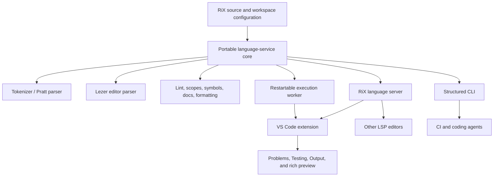

# RiX editor, language-server, execution, and AI tooling

::: {.callout-note title="Design target, not implemented surface"}
This document specifies the intended RiX authoring toolchain. Checked items in
the implementation checklist already exist in the RiX repository. Unchecked
items are proposed work and must not be presented as current behavior.
:::

## Objective

RiX should provide a responsive authoring experience in VS Code and other
editors, a safe way to run and inspect programs, structured reporting for
inline checks and tests, and deterministic feedback that coding agents can
consume without scraping human-oriented terminal output.

The implementation should expose one portable language-service core rather
than putting RiX semantics directly into each editor integration. A VS Code
extension is the first full client, but the static analysis and execution
protocols must remain host-neutral.

## Goals

- Highlight and edit `.rix` files, RiX documentation fences, and supported
  embedded notations accurately while a document is incomplete.
- Report parser and lint diagnostics with stable codes and exact source ranges.
- Provide completion, hover, symbols, navigation, rename, code actions,
  formatting, and plugin/custom-operator awareness through an LSP server.
- Run files and selections without blocking the editor or language server.
- Surface `.Test`, `##@`, `##:`, and `##!` results through structured events and
  appropriate native editor UI.
- Render RiX's portable rich outputs without making the editor a new evaluator
  or renderer authority.
- Give CI and coding agents stable JSON commands for the complete
  edit-check-run loop.
- Preserve RiX capability groups, plugin approval, and workspace trust at every
  execution boundary.

## Non-goals

- The LSP server does not evaluate arbitrary source to answer completion,
  hover, navigation, or lint requests.
- The VS Code extension does not become the source of truth for parsing,
  plugin resolution, formatting, or runtime semantics.
- The first release does not implement a full step debugger. Structured
  diagnostics, traces, AST/IR inspection, and restartable execution come first.
- The first release does not require Tree-sitter, a Jupyter kernel, an MCP
  server, or separate implementations for every editor.
- Rich output does not permit unsanitized plugin HTML or workspace scripts to
  execute in the extension host or webview.

## Existing foundation

The first implementation should reuse these current components rather than
replace them:

| Component | Current state | Intended reuse |
|---|---|---|
| Pratt parser and tokenizer | Implemented; semantic source of truth | Valid-document AST, static analysis, lowering, and execution |
| Lezer grammar and CodeMirror support | Implemented and tested | Error-tolerant editor structure, folding, indentation, highlighting classes, and embedded regions |
| `analyzeRix` / `lintRix` | Implemented | LSP diagnostics and code-action inputs |
| `explainRixScopes` | Implemented | Capture diagnostics, hover, local navigation, and rename safety |
| `complete` | Implemented for live contexts | Completion candidate model and runtime-session completion |
| CLI runner and REPL | Implemented | Execution behavior and initial worker adapter |
| `.Test` and diagnostics registry | Implemented | Structured test and diagnostic reporting foundation |
| `##@`, `##:`, and `##!` | Implemented | Inline checks and value-preserving diagnostic taps |
| Portable output and renderer registry | Implemented | Rich preview payloads and artifact rendering |

The important gaps are exact ranges on every relevant diagnostic, preservation
of source locations through lowering, pass events for inline checks, a stable
machine protocol, static symbol metadata independent of a live evaluator
session, and editor packaging.

## Architecture



### Proposed source layout

Keep portable logic inside the RiX package and editor packaging outside its
runtime surface:

```text
rix/
  src/tools/language-service/   document model, symbols, diagnostics, docs
  src/tools/lsp/                LSP request/response adapter
  src/tools/execution/          worker protocol and event serialization
  src/tools/codemirror/         existing CodeMirror integration
  src/tools/lezer/              existing tolerant editor grammar
  bin/rix-language-server.js    stdio LSP entry point
  bin/rix-worker.js             isolated execution entry point
  editors/vscode/               VS Code client, grammar, snippets, views
```

The VS Code extension may move to a separate repository when publishing and
release cadence require it. Its client/server protocol must not depend on its
physical repository location.

### Process boundaries

The system has three distinct processes or logical workers:

1. **Extension client:** owns VS Code registration and UI only.
2. **Language server:** owns side-effect-free document and workspace analysis.
3. **Execution worker:** owns mutable RiX contexts, plugin loading, evaluation,
   background tasks, and runtime diagnostics.

The language server must remain responsive if evaluation hangs or exhausts a
work budget. Killing or restarting an execution worker must not discard LSP
document state.

## Shared language-service contracts

### Document identity and versions

Every operation uses a document URI, monotonically increasing client version,
and exact source text. Results include the version they describe. Clients must
discard diagnostics, completions, runs, and rendered output produced for a
stale version unless the result is explicitly a saved-file run.

The service should cache by the tuple:

```text
document URI
document version or content hash
workspace configuration hash
plugin/operator metadata hash
```

### Source locations

RiX needs one internal zero-based half-open source span:

```js
{
    uri: "file:///workspace/example.rix",
    start: 24,
    end: 37
}
```

Line and column values are derived at protocol boundaries. LSP positions are
zero-based UTF-16 positions; terminal presentation may remain one-based. AST
nodes and lowered IR nodes that can produce user-visible events must retain a
source span or a stable source identifier that resolves to one.

Synthetic IR nodes should point to the nearest meaningful source construct and
carry a `synthetic` marker. Generated setup or preamble sources require their
own URI rather than pretending to belong to the main document.

### Static diagnostic record

Parser and lint diagnostics use a common serializable shape:

```json
{
  "uri": "file:///workspace/example.rix",
  "version": 12,
  "range": { "start": 24, "end": 31 },
  "severity": "warning",
  "code": "RX1001",
  "source": "rix-lint",
  "message": "'numerator' belongs to an enclosing scope",
  "hint": "Use '@numerator' to capture it",
  "related": [],
  "fixes": [
    {
      "title": "Capture numerator from the enclosing scope",
      "edits": [{ "range": { "start": 24, "end": 24 }, "text": "@" }]
    }
  ]
}
```

Diagnostic codes and meanings are public compatibility surface. Messages may
improve without changing a code, but changing the condition represented by a
code requires documentation and tests.

### Runtime event envelope

All execution output is transported as JSON Lines or equivalent framed
messages. Every event has an envelope:

```json
{
  "protocol": "rix.execution/1",
  "requestId": "run-42",
  "sequence": 7,
  "kind": "check",
  "uri": "file:///workspace/example.rix",
  "version": 12,
  "range": { "start": 24, "end": 37 },
  "time": 1786311123123,
  "payload": {}
}
```

Required event kinds are:

| Kind | Purpose |
|---|---|
| `run-start` | Resolved configuration, session identity, and source identity |
| `diagnostic` | Runtime error, warning, stop, or recoverable fault |
| `check` | Pass, fail, unresolved, or error for `##@` and `##:` |
| `test` | Discovered or completed `.Test`, `.TestError`, or `.TestStop` result |
| `log` | `##! Dump`, `Log`, ordinary log, or formatted textual output |
| `trace` | Structured call/write trace data |
| `result` | Final exact value plus safe display representations |
| `artifact` | Declared artifact metadata and approved path or content handle |
| `render` | Portable output or renderer result for rich preview |
| `run-end` | Duration, exit state, counts, and cancellation reason |

Event order is stable within a request. Binary content is referenced by a
bounded temporary artifact handle rather than embedded in JSON.

### Inline check event

Inline checks must emit successful outcomes as well as failures:

```json
{
  "checkKind": "predicate",
  "status": "failed",
  "label": "line 8 predicate check",
  "observed": { "text": "7" },
  "expected": { "source": "== 8" },
  "message": "Predicate returned null"
}
```

`status` is one of `passed`, `failed`, `unresolved`, `errored`, or `skipped`.
Type/shape checks use `checkKind: "structural"` and report the requested and
observed kind, semantic name, or shape. A source-derived stable check ID allows
the editor to update the same gutter/Test Explorer item across runs.

### Machine-readable symbol catalog

System functions, methods, capabilities, plugins, operators, and configuration
keys should be available through one generated catalog. Each callable entry
should include:

- canonical and display names;
- kind and namespace;
- signature and parameter metadata;
- concise and extended documentation;
- capability group and plugin owner;
- purity/laziness/async metadata when known;
- examples and documentation links;
- deprecation and replacement metadata;
- source or generated-definition identity.

Documentation, completion, hover, signature help, and AI-facing queries should
consume this catalog instead of maintaining separate hard-coded descriptions.

## Parsing and grammar policy

The Pratt parser remains the semantic authority. The Lezer grammar remains the
error-tolerant editor grammar and must accept useful partial source while the
user types.

- A complete document is semantically parsed with the Pratt parser.
- Lezer supplies structure, folding, indentation, selection ranges, lexical
  highlighting, and fallback syntax errors for incomplete source.
- Semantic lint runs only over a trustworthy Pratt AST. A parse failure must
  not produce misleading downstream scope diagnostics.
- A small TextMate grammar provides immediate baseline VS Code highlighting.
  Semantic tokens refine it after analysis.
- Shared token/operator metadata and golden source fixtures should generate or
  test all three grammar surfaces to detect drift.
- Embedded backtick regions retain their explicit notation identity. Hosts may
  delegate to a registered embedded-language parser but must preserve the
  original RiX range mapping.

## Language Server Protocol surface

The server communicates over stdio first. It should use standard LSP methods
wherever they fit and custom requests only for RiX-specific inspection.

### Required first-release methods

| LSP capability | RiX source |
|---|---|
| Diagnostics | Pratt parse plus `analyzeRix` |
| Completion | Static catalog, document scopes, plugin metadata, and adapted `complete` candidates |
| Hover | Symbol catalog, inferred ownership, operator and container help |
| Signature help | Callable catalog and current call argument |
| Document symbols | Assignments, functions, reactive cells, tests, and named containers |
| Definition | Current document declarations and resolved imported/operator definitions |
| References | Scope-aware identifier index |
| Rename | References with capture and system-name safety checks |
| Code actions | Machine-applicable lint fixes and safe syntax repairs |
| Folding ranges | Lezer container and comment structure |
| Selection ranges | Nested Lezer/AST structure |
| Semantic tokens | Declaration/reference roles, system names, captures, reactive names, methods |
| Formatting | Conservative token/AST formatter |

### Later standard methods

- workspace symbols;
- call hierarchy;
- inlay hints for inferred capture direction, structural shape, or plugin
  origin where they remain low-noise;
- code lens for run, check, test, AST, and IR commands;
- linked editing and document links for imports, operator files, plugins, and
  documentation;
- pull diagnostics if client support justifies them.

### RiX-specific requests

Custom requests should be few, versioned, and useful outside VS Code:

```text
rix/explainScope
rix/inspectAst
rix/inspectIr
rix/runtimeCompletions
rix/catalog
```

Runtime completions require an explicit execution-session ID. Static requests
must never silently start or mutate a session.

## Completion behavior

Completion combines several side-effect-free providers:

1. lexical and syntactic candidates appropriate to the cursor;
2. current and enclosing document bindings;
3. configured plugin and system-capability catalog entries;
4. custom operators visible to the document;
5. statically known members and map keys;
6. snippets for brace containers, functions, tests, checks, and diagnostics;
7. optional live-session values requested explicitly from the execution
   worker.

Every item should include a kind, insertion text, replacement range, signature
or short detail, documentation, source/plugin identity, and a stable sort key.
The server must not evaluate receiver expressions to discover members.

## Formatting

Formatting should be conservative until RiX style is settled. It must:

- preserve comments, tagged comments, documentation markers, and embedded
  notation contents;
- preserve the meaning and line-scoped behavior of `##@`, `##:`, and `##!`;
- be idempotent;
- avoid changing custom operator precedence through parenthesis removal;
- format only successfully parsed regions when a document contains errors;
- support whole-document, range, and format-on-type requests eventually;
- expose `rix format`, `rix format --check`, and editor formatting through the
  same implementation.

Golden formatting fixtures must include every brace sigil, nested comments,
custom operators, reactive syntax, async scopes, diagnostic taps, and embedded
backtick forms.

## Workspace configuration

The toolchain should support a versioned `rix.json` at the workspace or package
root. Source headers continue to provide per-file declarations. Command-line
arguments override file and workspace configuration in the usual order.

Proposed initial shape:

```json
{
  "$schema": "https://rix.ratmath.com/schema/rix.schema.json",
  "version": 1,
  "plugins": ["standard"],
  "operatorFiles": [],
  "preamble": null,
  "lint": {
    "level": "standard",
    "profiles": ["default"]
  },
  "format": {
    "enabled": true
  },
  "execution": {
    "mode": "isolated",
    "timeoutMs": 10000,
    "capabilityGroups": ["standard"],
    "artifactDirectory": ".rix-output"
  }
}
```

The exact fields and group names require a separate compatibility review
against runtime configuration before implementation. The schema must reject
unknown security-sensitive keys and provide descriptions/defaults to editors.

The language server watches resolved configuration, operator files, plugin
metadata, and preambles. It invalidates only documents whose effective inputs
changed.

## VS Code extension

### Declarative language support

The extension contributes:

- language ID `rix` and `.rix` file association;
- TextMate grammar and Markdown/Quarto fence injection;
- language configuration for comments, brackets, autoclosing, surrounding,
  indentation, and folding;
- snippets for common RiX constructs;
- semantic-token scope mappings compatible with ordinary themes;
- configuration schema and settings;
- commands, menus, keybindings, view containers, and Testing integration.

The extension should use ordinary theme scopes and semantic token types before
introducing RiX-specific types. System capabilities, outer captures, reactive
cells, and embedded notations may use custom modifiers when standard token
types are insufficient.

### Native UI mapping

Use existing VS Code UI before adding custom webviews:

| Information | Primary surface |
|---|---|
| Parse, lint, and runtime errors | Problems and editor squiggles |
| Final scalar/text result | Output channel and optional inline decoration |
| `.Test` groups and cases | Test Explorer |
| `##@` and `##:` checks | Gutter decoration, CodeLens, and optional Test Explorer items |
| `##! Dump` / `Info` | Output channel or Diagnostics tree |
| `##! Trace` / `Debug` | Expandable tree with source navigation |
| AST and IR | Read-only virtual document |
| Graphics, plots, sheets, controls, HTML, and documents | Rich preview webview |
| Declared files | Artifact tree and normal file links |

Inline decorations are summaries, not the only record. Every result remains
available through an accessible tree, Problems, Testing, or Output surface.

### Commands

The initial command set is:

```text
RiX: Run File
RiX: Run Selection
RiX: Check File
RiX: Run Tests
RiX: Restart Session
RiX: Show Output
RiX: Show AST
RiX: Show IR
RiX: Explain Scope at Cursor
RiX: Select Plugins and Capabilities
```

Run commands must make saved-versus-unsaved source behavior explicit. Running
an unsaved editor buffer sends its exact versioned content to the worker and
must not claim that generated artifacts came from the saved file.

### Rich preview

The preview consumes portable RiX output or an approved renderer result. It
does not call evaluator functions directly. Requirements include:

- strict Content Security Policy and per-load nonces;
- no arbitrary network access;
- sanitization of renderer HTML and URLs;
- theme-token styling, keyboard access, ARIA labeling, and text fallbacks;
- bounded message and artifact sizes;
- explicit disposal of reactive subscriptions and workers;
- source/version/session labels so stale results are visible;
- static snapshot support when interactive controls are unavailable.

The existing HTML/output widget implementation can be adapted, but editor
transport and security policy remain host-owned.

## Execution model

### Run modes

Support two explicit modes:

- **Isolated:** a fresh context for each file/check/test run. This is the
  default for reproducibility and CI.
- **Session:** a named restartable context used by selection evaluation and
  exploratory work. The UI always displays the active session and provides a
  restart command.

Selection execution in isolated mode evaluates only the selected source plus
an explicitly configured preamble. It does not silently execute the rest of
the file. Session mode may use prior successfully evaluated submissions but
must identify that dependency in the run record.

### Worker lifecycle

- One misbehaving run must be cancellable without restarting VS Code.
- Cancellation first uses cooperative abort; after a grace period the host
  terminates the worker.
- Timeouts, background-task draining, memory/output budgets, and maximum
  artifact sizes are explicit configuration.
- A crashed or terminated worker yields a structured `run-end`, and a new run
  starts a clean worker unless the user deliberately restores a safe session.
- The worker emits heartbeats or progress for operations expected to take long
  enough that the editor would otherwise appear stuck.
- Stdout/stderr from host tools are captured, bounded, and associated with the
  run rather than mixed with the LSP transport.

### Plugins and capabilities

Static plugin metadata may be inspected without installing or executing plugin
JavaScript. Execution resolves plugins through the normal catalog and approval
rules. Workspace-provided JavaScript installers require a trusted workspace and
explicit host approval.

The worker receives a capability allowlist, not an unrestricted system
context. A file cannot broaden that allowlist through a source header or
workspace-owned setting. Artifact writes are constrained to a resolved output
root and retain the CLI's path-escape checks.

## Checks, tests, and reports

### Discovery

The static service discovers source locations and provisional identities for:

- postfix predicate checks (`##@`);
- structural checks (`##:`);
- diagnostic taps (`##!`);
- `.Test`, `.TestError`, and `.TestStop` groups when their labels are statically
  available;
- documentation-only setup/output markers, which are identified but not
  treated as ordinary `.rix` file tests.

Dynamic test labels remain executable but may appear only after a run.

### Result presentation

- Failed and errored checks create source diagnostics.
- Passed checks receive a subtle gutter state and optional CodeLens summary.
- Unresolved exact decisions are distinct from failures.
- Test Explorer represents `.Test` groups and cases; inline checks may appear
  under a per-file “Inline checks” group when enabled.
- Selecting a result navigates to its precise source range.
- Re-running one discovered item is allowed only when the worker can preserve
  its setup and source semantics; otherwise the containing file/group runs.

### Reporters

All reporters consume the same event/summary model:

| Reporter | Intended consumer |
|---|---|
| Human terminal | Local command line |
| JSON | Editors, scripts, and coding agents |
| JSON Lines | Streaming editor/worker protocol |
| JUnit XML | CI test dashboards |
| SARIF | Static parser/lint diagnostics and code-scanning systems |
| HTML | Shareable combined source/check/output report |

Runtime values need a safe canonical summary. JSON reporters must not serialize
arbitrary cyclic runtime objects or rely on JavaScript class internals.

## Security and trust

The extension supports limited functionality in untrusted workspaces:

| Feature | Untrusted workspace | Trusted workspace |
|---|---:|---:|
| TextMate/semantic highlighting | Yes | Yes |
| Parsing, linting, symbols, and local formatting | Yes | Yes |
| Reading workspace JavaScript plugin metadata | Only declarative bounded metadata | Yes |
| Running RiX source | No | Yes |
| Loading workspace plugin installers | No | With explicit approval |
| Running host renderers/toolchains | No | With applicable approval/policy |
| Writing artifacts | No | Inside configured output root |

Security-sensitive settings must be declared as restricted workspace
configuration. Hiding a command is insufficient; command handlers must also
check trust and execution policy.

The execution worker is a containment boundary for reliability and accidental
damage, not a complete operating-system sandbox. Documentation and UI must not
claim stronger isolation than the host actually provides.

## CLI and coding-agent support

The CLI is the primary portable interface for coding agents. It should expose:

```text
rix parse --json file.rix
rix lint --json file.rix
rix symbols --json file.rix
rix explain-scope --json file.rix:line:column
rix format [--check] file.rix
rix check --json file.rix
rix test --json [filters...]
rix run --json --capabilities=standard file.rix
rix verify --json file.rix
```

`rix verify` is the preferred one-command feedback loop. It resolves the same
configuration as the editor, parses, lints, and runs enabled checks/tests,
then returns one versioned summary with deterministic exit codes.

Agent-facing support should also include:

- a concise canonical syntax and common-errors reference;
- generated callable/operator/plugin metadata;
- verified examples with source, AST/IR snapshots where useful, and expected
  results;
- stable diagnostics and machine-applicable edits;
- an `AGENTS.md` workflow describing `format -> verify -> inspect diagnostic`;
- small fixtures that exercise one language feature at a time.

An MCP server may later wrap `parse`, `lint`, `symbols`, `explainScope`,
`runSandboxed`, and documentation search. It must reuse the CLI/core contracts
rather than establish a separate semantic implementation.

## Testing and compatibility

### Test layers

- Unit tests for offsets, UTF-16 position conversion, diagnostics, symbols,
  completion, formatting, serialization, and configuration merging.
- Golden parser/Lezer/TextMate fixtures covering complete and partial source.
- LSP protocol tests with version changes, cancellation, multi-root workspaces,
  watched configuration, and stale responses.
- Execution protocol tests for event order, cancellation, crashes, timeouts,
  output limits, plugin denial, and artifact path traversal.
- VS Code integration tests for Problems, completion, navigation, formatting,
  Testing, trusted/untrusted behavior, and worker restart.
- Webview tests for CSP, sanitization, accessibility, disposal, and stale
  results.
- End-to-end fixtures that produce scalar, trace, test, Graphic, Sheet,
  reactive, and artifact output.

### Compatibility policy

- LSP uses standard capabilities and negotiates optional features.
- Custom LSP requests and execution events carry explicit protocol versions.
- `rix.json` carries a schema version.
- Diagnostic codes and report field meanings are documented compatibility
  surface.
- The extension declares supported RiX and protocol version ranges and reports
  mismatches clearly.
- Golden fixtures run in the RiX test suite so syntax changes cannot silently
  break editor support.

## Acceptance criteria for the first useful release

The first public extension release is complete when:

1. A `.rix` file receives correct baseline highlighting, comments, brackets,
   indentation, and folding.
2. Unsaved edits receive debounced parse/lint diagnostics with accurate ranges
   and no stale results.
3. Completion and hover cover local bindings, system capabilities, common
   methods, brace forms, and configured plugins without evaluating code.
4. Go to definition and document symbols work within one file.
5. `RX1001` and `RX1002` offer tested capture-direction code actions.
6. Run File and Run Selection use a restartable worker and support cancellation.
7. `##@`, `##:`, `##!`, and `.Test` emit structured source-linked results.
8. Scalar output uses native VS Code UI and at least Graphic and Sheet output
   render through a secured preview.
9. Untrusted workspaces retain static language features but cannot execute RiX
   or workspace plugins.
10. `rix verify --json` returns the same core diagnostics/check outcomes used by
    the extension.

## Implementation checklist

The phases are ordered so each leaves a usable, testable layer. Work may be
split into smaller pull requests, but later phases must not invent contracts
that bypass earlier ones.

### 0. Confirm design and public contracts

- [ ] Review and accept the three-process boundary.
- [ ] Choose the initial VS Code extension location, publisher ID, and release
  repository strategy.
- [ ] Choose the Node/Bun distribution strategy for desktop and whether a web
  extension is an initial requirement.
- [ ] Confirm internal byte/code-unit offsets and LSP UTF-16 conversion rules.
- [ ] Approve the static diagnostic schema.
- [ ] Approve `rix.execution/1` envelopes and event kinds.
- [ ] Approve check/test status semantics, including `unresolved`.
- [ ] Define protocol and configuration compatibility policy.
- [ ] Decide whether inline checks appear in Test Explorer by default.

### 1. Source spans and structured runtime events

- [x] Tokenizer records source offsets.
- [x] Parser nodes expose source-position data.
- [ ] Normalize parser node positions to documented half-open spans.
- [ ] Preserve source identity and spans through lowering for user-visible IR.
- [ ] Add structured parser errors with code, span, expected input, and hint.
- [ ] Give lint diagnostics end ranges and machine-applicable fix records.
- [x] Diagnostics registry stores ordered runtime events.
- [ ] Add URI, full range, request/session identity, and sequence to runtime
  events.
- [ ] Emit pass/fail/unresolved/error events for every `##@` and `##:` check.
- [ ] Attach source ranges to `##!` diagnostic events.
- [ ] Define safe runtime-value summaries for JSON transport.
- [ ] Add serialization and ordering tests.

### 2. Portable language-service core

- [x] Implement and test the Lezer editor grammar.
- [x] Export CodeMirror language support.
- [x] Implement static lint rules and JSON-oriented records.
- [x] Implement scope explanation.
- [x] Implement side-effect-free live-context completion primitives.
- [ ] Add a versioned document cache and cancellation points.
- [ ] Add a source/line index with UTF-16 LSP conversion tests.
- [ ] Create document symbol and reference indexes.
- [ ] Adapt completion to static scopes and catalog providers.
- [ ] Generate the machine-readable system/method/plugin/operator catalog.
- [ ] Implement hover and signature records independent of VS Code types.
- [ ] Implement definition, references, and rename planning.
- [ ] Implement code-action records from lint fixes.
- [ ] Implement conservative formatting and golden fixtures.
- [ ] Add shared grammar-drift fixtures for Pratt, Lezer, and TextMate surfaces.

### 3. Language server

- [ ] Add `rix-language-server` stdio entry point.
- [ ] Implement initialize/shutdown and capability negotiation.
- [ ] Synchronize versioned open documents and discard stale work.
- [ ] Publish parser and lint diagnostics with debounce/cancellation.
- [ ] Implement completion and completion resolution.
- [ ] Implement hover and signature help.
- [ ] Implement document symbols, definition, references, and rename.
- [ ] Implement code actions.
- [ ] Implement folding and selection ranges.
- [ ] Implement semantic tokens with delta support if practical.
- [ ] Implement document and range formatting.
- [ ] Watch `rix.json`, source headers, operator files, preambles, and plugin
  metadata.
- [ ] Support multi-root workspaces without sharing configuration accidentally.
- [ ] Add `rix/explainScope`, `rix/inspectAst`, `rix/inspectIr`, and catalog
  requests.
- [ ] Add protocol and cancellation tests.

### 4. VS Code extension baseline

- [ ] Scaffold `rix/editors/vscode` with extension-host tests.
- [ ] Register the `rix` language and `.rix` files.
- [ ] Add language configuration for comments, brackets, indentation, and
  folding.
- [ ] Add the baseline TextMate grammar.
- [ ] Add Markdown/Quarto RiX fence injection.
- [ ] Add semantic-token mappings and theme compatibility tests.
- [ ] Add snippets.
- [ ] Bundle or launch the language server with version checks.
- [ ] Map diagnostics to Problems and code actions to Quick Fix.
- [ ] Add AST/IR read-only virtual documents.
- [ ] Add Explain Scope at Cursor.
- [ ] Declare limited untrusted-workspace support and restricted settings.
- [ ] Test trusted, untrusted, virtual, and multi-root workspace behavior.

### 5. Execution worker and CLI protocol

- [x] CLI runs files, REPL submissions, and `.Test` suites.
- [x] CLI loads approved plugins and constrains artifact paths.
- [x] Runtime can render portable output and declared artifacts.
- [ ] Add a framed/JSON Lines worker entry point with no human stdout mixed into
  protocol output.
- [ ] Implement isolated and named-session run modes.
- [ ] Implement Run File, Run Selection, Check File, Run Tests, cancel, and
  restart requests.
- [ ] Add cooperative cancellation and forced termination grace period.
- [ ] Add time, output, background-task, artifact-size, and memory policies.
- [ ] Pass explicit capability/plugin allowlists into every run.
- [ ] Refuse workspace execution when trust is absent.
- [ ] Emit structured run, diagnostic, check, test, trace, result, render, and
  artifact events.
- [ ] Add crash recovery and clean-session tests.
- [ ] Add `--json` to run/test/check paths without parsing human output.
- [ ] Implement `rix verify --json` and stable exit codes.

### 6. VS Code execution and reporting UI

- [ ] Add Run File, Run Selection, Check File, Run Tests, cancel, and Restart
  Session commands.
- [ ] Display active source version, configuration, session, and run state.
- [ ] Send scalar/text output to a RiX Output channel.
- [ ] Add source-linked gutter and CodeLens states for `##@` and `##:`.
- [ ] Add `.Test` discovery and execution to Test Explorer.
- [ ] Add optional inline-check Test Explorer items.
- [ ] Add an accessible diagnostic/trace tree for `##!` events.
- [ ] Navigate from Problems, tests, checks, and traces to precise source.
- [ ] Add artifact tree/file links.
- [ ] Ensure stale run output is visibly marked and never decorates a newer
  document as current.
- [ ] Add continuous check/test mode with cancellation and debounce.

### 7. Rich preview

- [ ] Define the safe serialized preview payload.
- [ ] Reuse portable output and renderer contracts rather than evaluator
  internals.
- [ ] Implement CSP, nonces, sanitization, bounded messages, and URL policy.
- [ ] Render text fallback, Fragment, Graphic, Plot output, and Sheet.
- [ ] Add reactive controls through an explicit worker session channel.
- [ ] Dispose subscriptions, workers, and artifacts when a preview closes.
- [ ] Add theme, keyboard, screen-reader, and reduced-motion support.
- [ ] Add static snapshot behavior for unavailable interactive features.
- [ ] Add security and accessibility tests.

### 8. Reports, CI, and coding-agent workflow

- [x] Lint supports JSON output.
- [x] Scope explanation supports JSON output.
- [ ] Add parse, symbols, check, test, run, and verify JSON schemas.
- [ ] Add JUnit output for tests/checks.
- [ ] Add SARIF output for static diagnostics.
- [ ] Add an HTML combined report.
- [ ] Publish JSON schemas with the CLI and documentation.
- [ ] Document the deterministic agent edit/format/verify loop.
- [ ] Add verified small examples and common-error repair fixtures.
- [ ] Add CI examples for `rix format --check` and `rix verify`.
- [ ] Evaluate a thin MCP wrapper only after the core schemas stabilize.

### 9. Broader editor and debugging support

- [ ] Validate the LSP with at least one non-VS Code client.
- [ ] Publish generic LSP installation instructions.
- [ ] Decide whether browser/worker LSP support is worth the bundle constraints.
- [ ] Evaluate a notebook/Jupyter kernel after session and rich-output protocols
  stabilize.
- [ ] Design a Debug Adapter Protocol mapping from evaluator frames and trace
  events.
- [ ] Evaluate Tree-sitter only for a concrete consumer that cannot use LSP,
  Lezer, or TextMate.

## Open decisions

These choices should be resolved during Phase 0:

1. Should the published extension bundle a Node-compatible RiX runtime, require
   Bun, or support both with a selected runtime setting?
2. Is VS Code for the Web an initial target, or should the first release be a
   desktop extension with a later worker-based web server?
3. Should inline checks be first-class Test Explorer items by default, or stay
   in a dedicated Checks tree unless enabled?
4. What is the minimal formatter style that can be declared stable while RiX
   syntax continues to evolve?
5. Which plugin metadata can be read safely without executing plugin code?
6. Which existing portable renderer outputs are safe to send directly to a
   webview, and which require a dedicated sanitizer or adapter?
7. Should `rix.json` live at the RiX package root, workspace root, or nearest
   ancestor, and how are nested configurations composed?
8. Which runtime capability groups constitute the editor's proposed
   `standard` execution profile?

The first implementation should answer these explicitly rather than allowing
extension-specific defaults to become accidental language policy.
