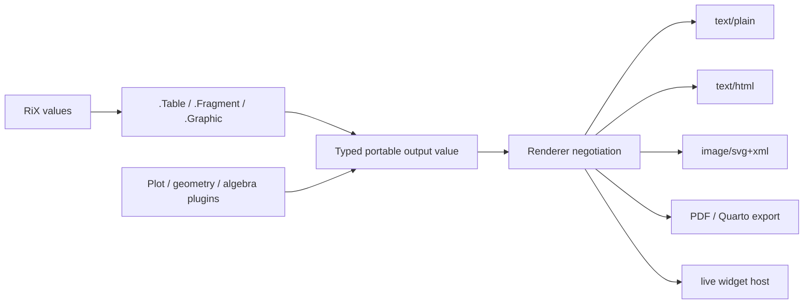
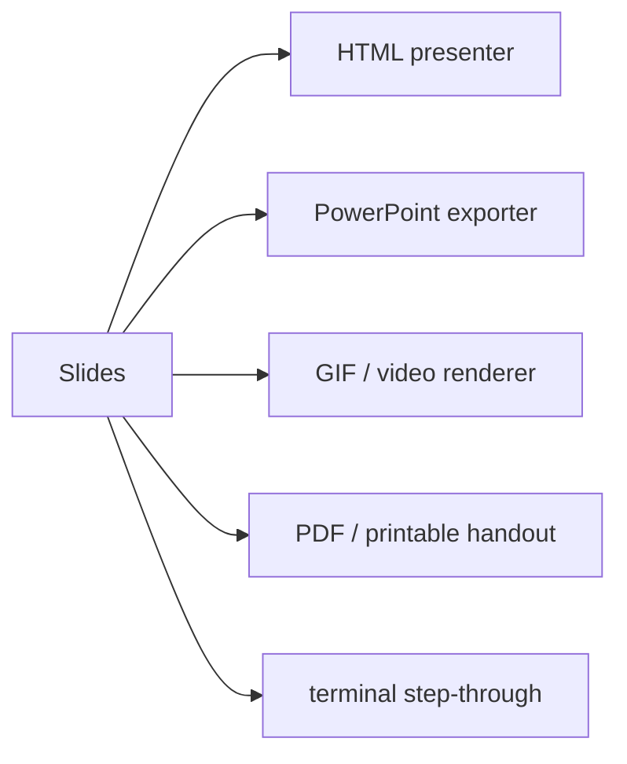

# Structured output, documents, and graphics

::: {.callout-note title="Implementation status — initial vertical slice"}
The initial portable-output slice is implemented: `.Text`, `.Paragraph`,
`.Heading`, `.Fragment`, `.Table`, `.Grid`, `.Path`, `.Graphic`, `.Figure`,
`.Slide`, and `.Slides` construct typed immutable output records. The CLI has a
text fallback, and the RiX notebook and RiX Web calculator render tables and
grids as HTML. `.Algebra.SyntheticDivision(root, coefficients)` is the first
algebra-layout helper and returns a ruled `Grid` using exact arithmetic.

Document-template syntax, output methods, renderer negotiation, SVG graphics,
plots, geometry, 3D scenes, plugin manifests, and non-HTML export targets
remain design work. Examples involving those features are deliberately marked
as intended contracts rather than current executable code.
:::

## Goal

RiX should be able to return useful output values—formatted tables, documents,
figures, and diagrams—without making the language depend on one UI, browser,
or file format.

The central separation is:

```text
RiX computation → portable output value → renderer negotiation → host display/export
```

A table remains a table whether it is displayed in a REPL, a notebook, HTML,
SVG, Quarto/PDF, or a saved report. A plot plugin constructs a portable graphic
value; it does not directly draw into a browser DOM. A browser, CLI, or export
host chooses a renderer appropriate to its capabilities.



The output value is the durable semantic object. MIME representations are
rendering products or caches, not the primary value.

## Scope and non-goals

The first output model is deliberately modest.

- It provides portable presentation descriptions and a small layout vocabulary.
- It retains exact RiX values until a renderer needs an approximation.
- It makes static output the default. Live, backend-dependent output is
  explicit through `Widget` values.
- It does **not** turn `Table` into a dataframe or query engine. A future
  `Relation`/dataset value can address data manipulation separately.
- It does **not** put HTML, SVG, Canvas, PDF, DOM, filesystem, or network
  access in the core constructors.

## Standard output capability group

The system context should expose a standard `Output` capability group. Its
members are available through the normal system-object syntax, so all source
calls are capitalized:

```rix
.Table(...)
.Fragment(...)
.Paragraph(...)
.Graphic(...)
.Figure(...)
.Grid(...)
.Heading(...)
.Text(...)
.Slide(...)
.Slides(...)
```

The parser normalizes system capability names internally, but source examples
use readable Pascal case. Map fields are data keys, not function names, and
remain lowercase:

```rix
.Table({= columns = columns, rows = rows })
```

The initial group should contain the following constructors and generic output
protocols.

| Value / operation | Role |
|---|---|
| `.Text` | Explicit text node, particularly useful in a document fragment. |
| `.Paragraph` | A block of document text; distinct from inline text. |
| `.Heading` | Structured document heading. |
| `.Fragment` | Ordered document/output children. |
| `.Table` | Semantic, tabular presentation of columns and rows. |
| `.Grid` | General positioned layout cells with spans and rules; suitable for mathematical layouts. |
| `.Graphic` | Portable retained-mode 2D scene. |
| `.Figure` | A graphic, table, or grid with caption, label, and accessibility metadata. |
| `.Slide` | One titled, metadata-bearing presentation frame. |
| `.Slides` | An ordered deck of `Slide` values, specialized for sequential presentation and export. |
| `.Render` / `value.Render(...)` | Resolve a renderer for a target or host context. |
| `.Snapshot` / `value.Snapshot(...)` | Produce a static representation where possible. |
| `.Serialize` / `value.Serialize()` | Preserve the portable value for notebooks, reports, and transfer. |

`Widget` and `Scene` are planned extension values. A `Widget` is explicitly
host/runtime-dependent. A `Scene` is a retained 3D scene that can be rendered
interactively or snapshotted to a `Graphic`; it should not be silently treated
as an ordinary 2D graphic.

## What the constructors do

The constructors do more than store an arbitrary input map, but they do not
render. They validate, normalize, and return transparent typed records with
stable invariants.

For example, `.Table` normalizes concise column labels into column descriptors,
checks row shape, records semantic table metadata, and preserves the actual
RiX values in cells:

```rix
.Table(["x", "F(x)"], rows)
```

is conceptually equivalent to:

```rix
.Table({=
    columns = [
        {= id = "x", label = "x" },
        {= id = "fX", label = "F(x)" }
    ],
    rows = rows,
    options = {= }
})
```

The internal representation can be map-like and inspectable, but must be a
semantic `Table` record rather than a map whose interpretation each renderer
has to guess. The same principle applies to `Graphic`, `Grid`, and document
nodes.

The core runtime should supply reliable plain inspection for every output
value, for example `Table: 2 columns × 10 rows` and `Graphic: 600 × 400, 7
scene nodes`. A standard text renderer may show an aligned terminal table.
Rich HTML, SVG, PDF, Canvas, and widget renderers remain plugins or host
adapters.

## Constructor forms and multifunctions

Every standard constructor has a canonical map form and compact overloads.
The map form is the complete, extensible API. Positional forms are conveniences
that normalize to the same canonical record.

```rix
.Heading({= level = 1, content = "Function values" })
.Heading(1, "Function values")

.Graphic({=
    size = [600, 400],
    children = [.Path({= points = points, style = {= stroke = "blue" } })]
})
.Graphic([600, 400], [.Path(points, {= stroke = "blue" })])

.Table({= columns = columns, rows = rows })
.Table(columns, rows)
.Table(columns, rows, {= caption = "Values of F" })
```

These variants should be system multifunctions (or capability shims that
delegate to system multifunctions). Their job is dispatch and normalization;
they all produce the same standard type. The explicit map variant is the
general fallback and makes later additions backward-compatible.

The proposed initial shapes are:

```rix
.Text({= value = text, style = {= } })
.Paragraph({= children = values, style = {= } })
.Heading({= level = integer, content = value, id = _, style = {= } })
.Fragment({= children = values, metadata = {= } })
.Table({= columns = columns, rows = rows, caption = _, options = {= } })
.Grid({= columns = columns, rows = rows, rules = [], style = {= } })
.Graphic({= size = [width, height], children = nodes, viewBox = _, metadata = {= } })
.Figure({= content = value, caption = _, label = _, alt = _ })
.Slide({= content = value, title = _, id = _, notes = _, metadata = {= } })
.Slides({= slides = values, title = _, theme = _, metadata = {= } })
```

Plain values in a `Fragment` or `Grid` cell are retained as values. A renderer
uses its formatting protocol to display an exact rational, interval,
polynomial, or string without converting it at construction time.

## Output methods and protocols

These are proposed methods, not a commitment to attach renderer code to every
type. Method dispatch invokes generic protocols that renderers and plugins may
extend.

| Applies to | Proposed methods | Meaning |
|---|---|---|
| Every output value | `.Inspect()`, `.With(spec)`, `.Serialize()`, `.Render(target, options)`, `.Snapshot(target, options)` | Inspect, make an immutable presentation variation, preserve, render, or make a static result. |
| `Fragment` | `.Append(value)`, `.Prepend(value)`, `.Flatten()` | Compose output without string concatenation. |
| `Table` | `.Columns()`, `.Rows()`, `.Cell(row, column)`, `.With(spec)`, `.Format(column, spec)` | Query presentation structure and create a changed view. |
| `Grid` | `.Cell(row, column)`, `.With(spec)`, `.WithRule(rule)` | Query or vary non-tabular layout. |
| `Graphic` | `.Bounds()`, `.Transform(transform)`, `.With(spec)` | Inspect and vary a scene without rasterizing it. |
| `Figure` | `.Content()`, `.Caption()`, `.With(spec)` | Access or vary document metadata. |
| `Slide` / `Slides` | `.Content()`, `.Notes()`, `.Append(slide)`, `.At(index)`, `.With(spec)` | Compose a deck without committing to an export format. |

`Table.With`, `Graphic.With`, and similar methods are immutable transformations:
they create a new output value. A plugin adds renderer or adapter registrations
rather than mutating an already-created value.

### Serialization and static/live distinction

Every portable output value must be serializable and reconstructable without a
renderer. `Table`, `Grid`, `Fragment`, `Graphic`, and `Figure` therefore carry
only semantic values, standard style metadata, and plugin-versioned extension
data.

```text
portable value     → can inspect, serialize, or render statically
Widget             → may require JavaScript and a plugin at viewing time
Scene              → may be live, but must offer a static Graphic snapshot when exported
```

When no rich renderer is installed, a host displays the portable text fallback
instead of failing because an SVG, browser, or graphics library is absent.

## Text interpolation and structured composition

Ordinary quoted strings remain literal:

```rix
"The value is @{x}."       ## literal characters; no interpolation
```

The proposed interpolated-text syntax is `@"..."`:

```rix
message := @"root near @{x}; error @{err}"
```

`@"..."` must be recognized by the tokenizer/parser as a dedicated literal.
Under today’s grammar it would parse as an `@` identifier adjacent to a string,
so reserving it is a deliberate small syntax change. Inside the template,
`@{expression}` is an evaluated hole. Outside a template, existing deferred
code keeps its meaning:

```rix
later := @{; F(x) }
```

The relationship is intentional: the outer template is literal context, and a
hole evaluates/splices a value into that context. Backticks should not be used
for interpolation: they are already reserved for embedded-language literals
and currently do not have an executable renderer path.

An interpolated string is text. If an output value is inserted into one, it
uses its deterministic text representation:

```rix
message := @"Computed @{table}"
```

That is useful for diagnostics, but cannot make `table` an interactive,
exportable table inside a string. Structured output is composed directly:

```rix
report := .Fragment({=
    children = [
        .Text(@"Computed values:"),
        table
    ]
})
```

A future document-template literal may preserve a table or graphic inserted at
a document-level hole. It should be a distinct `Fragment`-producing construct,
not an accidental behavior of text interpolation.

## Document templates

`Fragment` is the semantic document structure, but it should not be the only
way to author a report, explanation, or handout. A light document template
should compile to a `Fragment` and use ordinary RiX only for computation.

### Proposed syntax

Use `@"""..."""` for a document template. The leading `@` identifies a
template and the triple-double-quote delimiter signals block-oriented document
content:

```rix
report := @"""
h1: Quadratic analysis

The selected values are shown below.

table: Values of F #tbl:values
    @{values}

fig: Graph of F #fig:curve
    @{curve}
"""
```

The template evaluates to a `Fragment` conceptually equivalent to:

```rix
.Fragment({=
    children = [
        .Heading(1, "Quadratic analysis"),
        .Paragraph("The selected values are shown below."),
        .Figure({= content = values, caption = "Values of F", label = "tbl:values" }),
        .Figure({= content = curve, caption = "Graph of F", label = "fig:curve" })
    ]
})
```

The triple delimiter is important. `@"..."` remains the compact interpolated
**text** form; `@"""..."""` is the block/document form. The parser may allow
four or more matching double quotes when literal triple quotes are needed in a
template, following RiX's general variable-length double-quote delimiter rule.

`@'''...'''` is not recommended. RiX already uses the single quote for
integrals and postfix derivatives, so adding a single-quoted template family
would create a much less clear lexical boundary. The double-quote form keeps
both template forms under the existing `@` family without taking calculus
syntax.

### Small block grammar

The document language should start with a small, deliberately non-programming
grammar:

```text
Document   := Block (blank-line Block)*
Block      := plain paragraph | known-directive ":" inline-content [indented body]
```

- A blank line ends a paragraph and starts the next document object.
- Adjacent nonblank, non-directive lines form one paragraph; ordinary line
  wrapping is not a sequence of separate `Text` objects.
- Only a fixed set of known directive names is special. A prose line such as
  `Note: this is useful` remains a paragraph unless `note` is deliberately
  added as a directive.
- An indented body belongs to the preceding directive. It is where a figure,
  table, code block, or slide places its structured content.
- `@{expression}` is a RiX expression hole. A hole on an otherwise blank
  document line splices its output value as a child; a hole inside paragraph
  text uses that value's text-format protocol.
- Directive headers may end with `#label`. Labels are metadata, not text.

The initial directive vocabulary should be intentionally small:

| Directive | Produces | Example |
|---|---|---|
| `h1:` … `h6:` | `Heading` | `h2: Exact roots` |
| `p:` or plain paragraph | `Paragraph` | `p: The interval is certified.` |
| `fig:` | `Figure` | `fig: Graph of F #fig:curve` |
| `table:` | `Figure` containing a table | `table: Sample values #tbl:values` |
| `quote:` | quotation/aside block | `quote: Exact before approximate.` |
| `code:` | code block | `code: rix` followed by indented RiX source |
| `math:` | display math block | `math: @{formula}` |
| `ul:` / `ol:` | list | an indented list body |
| `slide:` | `Slide` | a presentation frame, described below |

The directive name must be at the start of a physical line. Extensions should
add names through a template-directive registry rather than making all
`letters:` lines magical.

### Structured holes and ordinary RiX

RiX remains the only computation language. A document template does not grow
its own loop, conditional, or function syntax:

```rix
rows := xs |>> (x) -> [x, F(x)]
values := .Table(["x", "F(x)"], rows)

report := @"""
h1: Results

@{values}

p: The final value is @{F(4)}.
"""
```

The standalone `@{values}` hole inserts the actual `Table` into the fragment.
The inline `@{F(4)}` hole becomes text in the paragraph. This is the key
distinction that avoids requiring authors to choose between template convenience
and portable structured output.

### Why not make the template a full Markdown clone?

The template can grow compatibility adapters later, but it should begin as a
small RiX-specific authoring surface. It has only enough syntax to create
document nodes, labels, and structured holes. This keeps the mapping to
`Fragment` predictable and allows normal RiX values—exact intervals, graphics,
tables, and grids—to appear without HTML escaping or string reconstruction.

Markdown, Quarto, or Pandoc import/export can be implemented as renderer or
adapter plugins once the document value model is stable.

## Slides and sequential output

`Slides` should be a standard sequential presentation value: an ordered deck
of `Slide` objects. It is not a PowerPoint file and it is not an animation
format. Those are render targets selected later.



A slide contains normal output objects plus presentation metadata such as a
title, stable id, speaker notes, timing hints, and transition hints. Its content
is normally a `Fragment`; it may contain a `Graphic`, `Table`, `Grid`,
`Figure`, or another document node.

```rix
deck := .Slides({=
    title = "A quadratic in three views",
    slides = [
        .Slide({=
            title = "The polynomial",
            content = .Fragment([
                .Heading(1, "F(x) = x^2 - 2*x + 1"),
                .Text("Exact values, a graph, and synthetic division.")
            ])
        }),
        .Slide({=
            title = "Values",
            content = .Figure({= content = values, caption = "Selected values" })
        }),
        .Slide({=
            title = "Division",
            content = .Figure({= content = division, caption = "Synthetic division by x - 1" }),
            notes = "Point out that the remainder is -3."
        })
    ]
})
```

Document templates can provide a concise deck authoring form by compiling
top-level `slide:` directives into `Slide` values. Wrapping that fragment in
`.Slides(...)` validates that every top-level child is a slide:

```rix
deck := .Slides(@"""
slide: The polynomial #intro
    h1: F(x) = x^2 - 2*x + 1
    p: We will examine values, a graph, and a division layout.

slide: The graph #curve
    fig: Graph of F
        @{curve}

slide: Synthetic division #division
    fig: Division by x - 1
        @{division}
""")
```

The `Slides` value allows a host to render sequentially, to export a slide deck,
or to make a timed GIF/video only when that target supports the requested
features. A renderer must report unsupported animation or transition features
rather than silently discarding them.

## Realistic uses

### Table of exact function values

This is the baseline dynamic-table use case. `|>>` is the elementwise map
pipe; `|>` would pass the whole array to the function once.

```rix
F := (x) -> x^2 - 2*x + 1
xs := [0, 1, 2, 3, 4]

values := .Table({=
    columns = [
        {= id = "x", label = "x", align = :right },
        {= id = "f", label = "F(x)", align = :right }
    ],
    rows = xs |>> (x) -> [x, F(x)],
    caption = "Selected values of F"
})
```

The stored entries are RiX values, not preformatted decimal strings. A display
or export renderer decides whether to show `1/3`, `0.3333`, LaTex math, or a
host-specific display according to an explicit formatting context.

### A report with a table and figure

Document structure is ordinary output composition. It does not introduce a
second control-flow or loop language.

```rix
curve := .Plot.Function({=
    fn = F,
    domain = [-2, 4],
    axes = {= x = true, y = true },
    label = "F(x)"
})

report := .Fragment({=
    children = [
        .Heading(1, "Quadratic analysis"),
        .Text(@"The vertex occurs at x = @{1}."),
        .Figure({=
            content = curve,
            caption = "Graph of F",
            label = "fig:quadratic",
            alt = "An upward-opening parabola"
        }),
        .Figure({=
            content = values,
            caption = "Sampled values of F",
            label = "tbl:values"
        })
    ]
})
```

`.Plot.Function` belongs to a plotting plugin. Its result is a standard
`Graphic`, so the report itself remains portable.

### Function plot and heat map

The plot plugin owns axes, scales, ticks, curve sampling, discontinuity
handling, and color scales. It returns standard graphics rather than a DOM
object or chart-library object.

```rix
F := (x) -> x^3 - 3*x

curve := .Plot.Function({=
    fn = F,
    domain = [-3, 3],
    size = [720, 420],
    samples = 500,
    style = {= stroke = "#2463a5", width = 2 }
})

H := (x, y) -> .Exp(-(x^2 + y^2))

heat := .Plot.HeatMap({=
    fn = H,
    x = [-3, 3],
    y = [-3, 3],
    resolution = [160, 160],
    colors = .ColorScale("viridis"),
    legend = true
})
```

The heat-map plugin may lower each colored tile to a standard `Graphic`, or it
may retain a portable `HeatMap` extension node that an SVG/Canvas renderer
understands. In either case, it must provide a static snapshot path.

### Synthetic geometry construction

The geometry plugin holds exact geometric objects and constructions. Drawing
is an explicit conversion to a graphic, so a proof/construction remains
separate from its visual presentation.

```rix
A := .Geometry.Point([0, 0])
B := .Geometry.Point([6, 0])
C := .Geometry.Point([2, 4])

ab := .Geometry.Line(A, B)
ac := .Geometry.Line(A, C)
bc := .Geometry.Line(B, C)

bisector := .Geometry.AngleBisector(A, B, C)
D := .Geometry.Intersection(bisector, ac)

diagram := .Geometry.Draw({=
    objects = [ab, ac, bc, bisector, A, B, C, D],
    labels = {= A = "A", B = "B", C = "C", D = "D" },
    size = [640, 420]
})
```

`D` may have exact or interval coordinates. The renderer chooses an
approximation policy only while creating pixels or SVG coordinates.

### 3D scene construction

The 3D plugin produces a retained `Scene` rather than treating WebGL state as
the value. A host with an interactive renderer can orbit the camera; an export
host can ask for an SVG/PNG `Graphic` snapshot.

```rix
surface := .Scene3D.ParametricSurface({=
    fn = (u, v) -> [u, v, .Sin(u) * .Cos(v)],
    u = [-3, 3],
    v = [-3, 3],
    material = {= color = "#4b9cd3", opacity = 0.85 }
})

scene := .Scene3D({=
    objects = [surface],
    camera = {= position = [6, 5, 7], target = [0, 0, 0] },
    lights = [{= type = :directional, direction = [1, -1, -1] }]
})

staticFigure := scene.Snapshot(:svg, {= size = [720, 480] })
```

### Synthetic division: use a grid, not a data table

Synthetic division has mathematical layout—aligned numbers, a vertical bar,
and a horizontal rule—not a table of independent records. It should therefore
use `Grid`, which supports cell spans and rules, rather than overloading
`Table` with layout-specific behavior.

A direct layout can be written with core primitives:

```rix
division := .Grid({=
    columns = [{= width = :auto }, 1, 1, 1, 1],
    rows = [
        [1, 2, -6, 2, -1],
        [_, _, 2, -4, -2],
        [_, 2, -4, -2, -3]
    ],
    rules = [
        {= kind = :vertical, afterColumn = 1, rows = [1, 2] },
        {= kind = :horizontal, aboveRow = 3, columns = [2, 5] }
    ],
    style = {= align = :right, math = true }
})
```

It renders as the familiar calculation:

```text
  1 │  2  -6   2  -1
    │      2  -4  -2
    ├────────────────
    │  2  -4  -2  -3
```

An algebra-layout plugin should make this even easier while returning the same
portable `Grid`:

```rix
division := .Algebra.SyntheticDivision(1, [2, -6, 2, -1])
```

The plugin calculates the intermediate products and sums, adds the standard
grid rules, and can attach explanatory metadata. It does not need HTML/CSS or
an SVG implementation. The same `Grid` can be embedded in a `Figure` or a
report and rendered by terminal, HTML, LaTex, or PDF renderers.

## Plugin contract

Plugins participate in one or more narrowly defined roles:

| Role | Example | Returns / contributes |
|---|---|---|
| Constructor plugin | `Plot`, `Geometry`, `Algebra` | Standard `Graphic`, `Grid`, `Table`, `Scene`, or `Fragment` values. |
| Renderer plugin | `Svg`, `Html`, `Terminal`, `Pdf` | Render handlers for standard values and target MIME types. |
| Host adapter | notebook webview, CLI, PDF exporter | Renderer negotiation, asset storage, display, and export. |
| Widget plugin | interactive 3D viewport | A `Widget` plus an explicit static snapshot implementation. |

Each plugin should declare at least:

```text
id and version
RiX and output-schema compatibility range
capabilities it provides
input/output value types and renderer targets
required permissions (for example: none, files, network, DOM)
serialization/extension schema and snapshot support
```

For example:

```toml
id = "rix-plot"
version = "0.1.0"
requires_rix = ">=0.1"
requires_output_schema = "1"

[provides]
capability_group = "Plot"
constructors = ["Plot.Function", "Plot.HeatMap", "ColorScale"]
output_types = ["Graphic"]

[permissions]
default = []
```

Renderer selection is a protocol dispatch, conceptually:

```text
Render(value, target, options)
  1. choose a renderer that declares support for the value type and target;
  2. supply explicit approximation, styling, and asset options;
  3. return a MIME representation or a clear unsupported-target result.
```

An output plugin may use namespaced extension metadata, but it should never
require every consumer to load its implementation just to inspect or serialize
the base output value.

## Repository and distribution strategy

The initial first-party plugin library should live in the main RiX repository.
The output schema, constructor semantics, test fixtures, and standard plugins
will evolve together during the alpha phase; a monorepo makes those API changes
reviewable and testable as one unit.

Suggested eventual layout:

```text
rix/
  src/                         # language and standard output schema
  plugins/
    output-basic/              # text fallback and shared helpers
    svg/                       # Graphic/Grid/Table → SVG
    html/                      # Fragment/Table/Figure → HTML
    plot/                      # function plots, axes, heat maps
    geometry/                  # constructions → Graphic
    algebra-layout/            # synthetic division and related layouts
    scene3d/                   # Scene construction and snapshots
  hosts/
    cli-output/
    notebook-output/
```

This does not require every host to bundle every plugin. A CLI might load
`output-basic`, `algebra-layout`, and `svg`; a notebook host might additionally
load `plot`, `html`, and `scene3d`.

Separate repositories become useful once a plugin has an independent release
cadence, substantial external/native/browser dependencies, or third-party
ownership. The public plugin contract should be stable before encouraging that
split. Regardless of repository location, a plugin must depend on the shared
output-schema package rather than copy the type definitions.

## Implementation sequence

1. Define the serializable output record schema and base inspection format.
2. Add the `Output` capability group and the map/positional constructor
   multifunctions for `Text`, `Heading`, `Fragment`, `Table`, `Grid`,
   `Graphic`, and `Figure`.
3. Implement serialization and a basic terminal renderer, including grid rules.
4. Add the SVG/HTML renderer plugins and snapshot/renderer negotiation.
5. Build one constructor plugin at a time: algebra layout first, then plotting,
   geometry, heat maps, and 3D scenes.
6. Add the `@"...@{...}..."` interpolated-text syntax after the output types
   and text-format protocol are established.

The synthetic-division plugin is a useful early acceptance test: it exercises
exact values, grid layout, rules, math formatting, embedding in documents, and
multiple renderers without requiring a full plotting stack.
