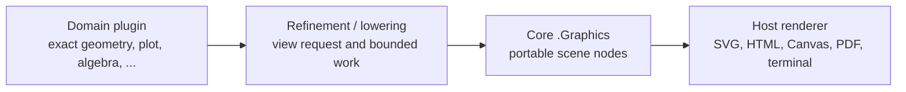

# Plugin Roadmap and Rendering Contracts

::: {.callout-note title="Design roadmap, not implemented surface"}
This document distinguishes capabilities already bundled with RiX from useful
future plugins. A listed API is a design target unless the current
[implementation status](../status.qmd) says otherwise.
:::

RiX should keep a compact language and common portable output model while
letting domain packages add mathematical operations and authoring tools. A
plugin may construct ordinary values, extend a method/protocol, or contribute a
host renderer. It should not make its own private rendering format the normal
exchange format.

## The boundary

The output path has three deliberately separate responsibilities:



- A domain plugin retains the semantics: equations, constraints, datasets,
  transformations, provenance, and any exact arithmetic.
- Its refinement/lowering operation chooses enough finite detail for one
  requested view.
- Core `.Graphics` holds the static scene that every renderer can understand:
  `Graphic`, `Path`, `Group`, `Transform`, `Text`, `Rectangle`, `Circle`, and
  `Clip`.
- A host renderer converts only the core scene into SVG, Canvas, PDF, or a text
  fallback. It does **not** need to know how to solve an ellipse.

This is why `.draw` is a plugin-style authoring layer rather than a renderer
contract: `.draw.Line(...)` and `.draw.Circle(...)` simply return core
`.Graphics` nodes.

## Current starting point

| Capability | Current state | Role |
|---|---|---|
| Core `.Graphics` | Implemented | Portable 2D retained scene schema and SVG lowering. |
| `.draw` | Implemented, bundled first-party plugin | Load with `.Plugin.Load("draw")`; its authoring helpers return `.Graphics` values. |
| `.Algebra.SyntheticDivision` | Implemented, bundled | Exact arithmetic laid out as a portable `Grid`. |
| `.plot.Polynomial` | Implemented, bundled | Load with `.Plugin.Load("plot")`; produces a portable static `Graphic`. |
| Plugin discovery/installation | Implemented catalog | The CLI and hosts discover YAML-headed `.plugin.rix`/`.plugin.rix.js` entries, expose `.Plugin.List`/`.Info`/`.Load`, and require host approval for JavaScript installers. |

First-party plugins may live in the main RiX repository and be installed
selectively by the CLI, notebook, or web host. Independently developed plugins
can already use the catalog format; the remaining work is to mature its
compatibility, serialization, and permission policies. The operational details
are in [Plugin catalog](../plugin-catalog.md).

## Candidate plugin roadmap

The groups below are candidates, not a promise that all should be implemented.
The first two build directly on the current graphics work.

| Priority | Plugin | Main values and operations | Portable output / notes |
|---|---|---|---|
| Next | `.geometry` | Points, lines, circles, conics, transformations, constructions, intersections, `Implicit`, and certified `Refine`. | Lowers diagrams and implicit loci into `.Graphics`; retains exact specifications and isolating regions outside the graphic. |
| Next | `.plot` expansion | Function, parametric, implicit, scatter, bar, axes, scales, legends, viewport fitting, discontinuity handling. | Produces `.Graphics`; interactive controls belong in a separate widget layer and always need a static snapshot. |
| Next | `.draw` expansion | Arrowheads, dimensions, callouts, paths/builders, alignment/layout helpers. | Pure authoring sugar over `.Graphics`, not a second scene format. |
| Later | `.scene3d` | Meshes, curves, surfaces, camera, light, material, projection, snapshot. | Own retained `Scene3D` schema; snapshots lower to `Graphic`/SVG or raster assets. It should not overload the 2D scene node vocabulary. |
| Later | `.data` / tables | Relations, schemas, sorting, filtering, joins, calculated columns, table views and formatters. | A `TableView` lowers to core `Table`; CSV is an exporter of data, not a replacement for a presentation table. |
| Later | `.stats` | Distributions, summaries, regression, histograms, confidence intervals. | Returns data/analysis values; chart constructors compose with `.plot`. |
| Later | `.graph` | Nodes, edges, layouts, paths, graph algorithms. | Layout output becomes `.Graphics`; graph semantics stay available for computation. |
| Later | `.numerics` | Root isolation, integration, ODEs, optimization, certified-real adapters. | Supplies certified or explicitly approximate values to `.geometry` and `.plot`; it should surface error bounds. |
| Later | `.solve` | Polynomial systems, constraints, symbolic/numeric solving. | Returns solution objects and isolating boxes; `.geometry` can visualize them. |
| Later | `.document` extras | Citation, bibliography, cross-references, themes, code/output inclusion. | Produces core `Fragment`, `Figure`, `Table`, and `Slides` values; renderers own HTML/Quarto/PDF specifics. |
| Host-dependent | `.widgets` | Sliders, selection, animation, browser events. | Requires runtime-specific JavaScript; must declare capability needs and provide a portable static snapshot. |
| Host-dependent | Exporters | SVG, HTML, Quarto, PDF, PNG, terminal. | These are renderer plugins/adapters, selected by MIME/target negotiation rather than mathematical libraries. |

Potential high-level packages should depend downward: `.geometry` and `.plot`
depend on exact/numerical services and emit core graphics; renderers depend on
core graphics but not on `.geometry` or `.plot`.

## Geometry implicit equations to graphics

An implicit equation must remain a geometry value while it is being reasoned
about. The expression `4(x - 5)^2 + 3(y - 6)^2 = 7` is not itself a path, and
passing its parser expression to an SVG renderer would make rendering
backend-specific and lose uncertainty information.

A proposed geometry API is:

```rix
# Proposed, not implemented
ellipse := .geometry.Implicit({=
    equation = {#x, y# 4*(x - 5)^2 + 3*(y - 6)^2 - 7 },
    variables = [:x, :y],
    domain = {= x=[2, 8], y=[3, 9] }
})

request := {=
    viewport = {= x=[2, 8], y=[3, 9] },
    size = [720, 480],
    tolerance = 1 / 1000,
    maxWork = 20000,
    boundary = :report_uncertain
}

result := ellipse.Refine(request)
graphic := result.graphic
```

The refinement has this contract:

1. `.geometry.Implicit` stores a serializable symbolic equation, variable
   bindings, declared domain, exact parameters, and plugin/schema identity.
   It does not sample the equation at construction time.
2. `Refine` receives the renderer-independent view request: mathematical
   viewport, output pixel size, tolerance, a finite work budget, and a policy
   for unresolved boundaries.
3. Geometry evaluates the equation over boxes using its exact or interval
   machinery. A box whose range cannot contain zero is discarded. Boxes that
   can contain the zero locus are subdivided and traced—for example via
   interval-certified adaptive marching squares or a conic-specific exact
   routine.
4. Once detail is sufficient, the plugin creates ordinary
   `.Graphics.Path`, `.Graphics.Group`, `.Graphics.Text`, and related nodes.
   The result is a fixed portable scene for that request.
5. The renderer receives `result.graphic`, not the equation. It applies only
   graphic coordinate conversion and target styling.

The returned object should preserve both display and mathematical evidence:

```text
AdaptiveRenderResult
  graphic       # core .Graphics.Graphic for this request
  resolved      # whether every requested feature reached tolerance
  uncertainty   # remaining boxes, interval evidence, and boundary status
  work          # subdivisions/evaluations and exhausted budget status
  source        # serializable geometry value + plugin/schema version
```

For an intersection of two exact objects, `.geometry.Intersect` should return a
constraint/intersection value first. `Refine` then isolates one or more boxes
whose dimensions are below the requested display tolerance. A renderer can
draw a marker at a resolved representative; if a point cannot be distinguished
from a viewport, clip, or pixel boundary within `maxWork`, `resolved` is false
and `uncertainty` explains why. It must not silently decide which side of the
boundary contains the point.

### What crosses the boundary

```text
`.geometry.Implicit` / `.geometry.Intersection`
    exact symbolic specification, interval evaluator, construction provenance
                         |
                         | Refine(viewport, tolerance, maxWork)
                         v
AdaptiveRenderResult.graphic
    finite .Graphics scene: paths, labels, markers, styles
                         |
                         | render(target)
                         v
SVG / Canvas / PDF / terminal representation
```

The core scene may preserve exact coordinates where it can, but it should not
contain arbitrary JavaScript closures or an opaque geometry evaluator. A saved
document can therefore carry two things independently:

- a static `.Graphics` snapshot that any compatible viewer can display; and
- the serializable geometry specification, which can be re-refined only when
  its identified geometry plugin is available.

## Certified numerics contract

Different real-number representations should interoperate through certified
evidence, not by converting every value to an IEEE-754 number. An oracle, a
Cauchy sequence, a continued fraction, an algebraic isolating interval, and an
arbitrary-precision float may all represent a real number differently. A
numerical algorithm should only require that the representation can either
produce a proven rational enclosure at a requested tolerance or report that it
cannot meet the request within a bounded amount of work.

The proposed common operation is `.numerics.Enclose` (with a value-level
`value.Enclose` convenience where a type supports it):

```rix
# Proposed, not implemented
e := .numerics.Enclose(realValue, {=
    absoluteWidth = 1 / 1000000,
    relativeWidth = _,
    maxWork = 50000
})
```

It returns an `Enclosure` record:

```text
Enclosure
  interval       # exact RationalInterval [lower, upper]
  certified      # the represented real is proven to be in interval
  goalMet        # requested width was reached
  work           # representation-specific bounded-work report
  source         # representation type and its approximation/proof policy
```

`lower` and `upper` must be exact rationals. This lets generic root isolation,
sign tests, plotting, comparison, and display algorithms consume values from
unrelated plugins without sharing their internal representation. Algorithms
refine only while needed: if one enclosure lies wholly below another, ordering
is decided; if they overlap, they ask for narrower enclosures. Equality is
never inferred from overlap—only an exact witness or a representation-specific
proof may establish it.

Representation plugins meet the contract differently:

| Representation | How it obtains a certified enclosure |
|---|---|
| Oracle real | Ask the oracle for a rational interval of the requested width. |
| Cauchy sequence | Use a supplied convergence modulus to select a rational term and a proven tail-error bound. A bare sequence without a modulus is not certifying. |
| Continued fraction | Use convergents plus a certified bound on the remaining tail. A finite prefix alone is insufficient unless the value is rational or has a declared tail theorem. |
| Algebraic/constraint real | Refine its existing rational isolating interval with exact sign or root-counting evidence. |
| Arbitrary-precision interval/ball | Increase precision and outward-round to rational endpoints. |
| IEEE-754 float | It can enclose its *stored binary value* exactly as a dyadic point. Transcendental results need directed-rounding/error analysis to claim enclosure of a mathematical real; otherwise they must mark the result heuristic rather than certified. |

The corresponding generic operations should be deliberately small:

```text
.numerics.Enclose(value, request)      -> Enclosure
.numerics.Refine(value, request)       -> value or Enclosure with tighter evidence
.numerics.Compare(left, right, request)-> :less | :equal | :greater | :undecided
.numerics.Sign(value, request)         -> :negative | :zero | :positive | :undecided
```

`request` always carries an explicit work cap. An algorithm may return
`:undecided` together with its latest enclosures rather than run forever on
equal, extremely close, or poorly specified values. Operations such as `Sin`,
root finding, and integration can install representation-specific evaluator
variants, but their public certified path must eventually be expressible as an
`Enclosure`. That gives `.geometry.Refine` and `.plot` one uniform way to ask
for display precision while retaining each numerical plugin's strengths.

## Plugin contract to mature

The current catalog already identifies a plugin, mount, exports, groups, and
declared permissions. As independently distributed plugins become common, its
manifest/protocol should additionally standardize:

- plugin name, version, compatible RiX/runtime versions, and namespaces;
- values, methods, and capability groups it contributes;
- serializable value schema and migration policy;
- pure computation versus requested filesystem, network, native, DOM, or
  JavaScript capabilities;
- output types it produces and static snapshot support;
- renderer targets/MIME types it consumes or provides; and
- deterministic refinement controls: tolerance, work limits, seeds, and
  diagnostics.

That preserves a useful distinction: third-party mathematical plugins can
remain portable and sandboxable, while host integrations such as browser
widgets declare their broader capability requirements explicitly.

## Near-term decisions

1. Define the `.geometry` value schema and exact/interval evaluation interface.
2. Agree on the `Refine` request/result maps and their serialization form.
3. Add a conic/implicit-curve proof-of-concept with visible unresolved-cell
   reporting and snapshot tests.
4. Extend the existing manifest and host installation API once independently
   developed plugin schemas need version migration.
