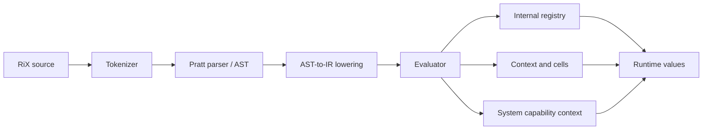

RiX is deliberately layered. Syntax is parsed without executing it; AST nodes lower to a compact intermediate representation; the evaluator dispatches that IR through registries and an explicit system capability context.



## Repository map

| Path | Responsibility |
|---|---|
| `src/parser/tokenizer.js` | maximal-munch tokens, positions, number/string/comment forms |
| `src/parser/parser.js` | Pratt parser, container syntax, AST construction |
| `src/parser/system-loader.js` | host configuration for parser-visible system names |
| `src/eval/lower.js` | AST to `{ fn, args }` IR |
| `src/eval/evaluator.js` | recursive evaluation, imports, capability frames, defaults |
| `src/eval/registry.js` | internal operation registry and multifunction variants |
| `src/eval/functions/` | core, arithmetic, collections, control, methods, diagnostics, units, symbolic work |
| `src/runtime/` | contexts, cells, metadata, types, tensors, methods, exact values, diagnostics |
| `bin/` | REPL/runner and IR conversion CLI |
| `tests/` | parser, evaluator, runtime, and tool behavior |

## Two registries with different jobs

The internal `Registry` contains operations used by lowered IR: assignment, retrieval, calls, container construction, pipes, property access, and arithmetic dispatch. Most are implementation machinery and are not ambient user functions.

The `SystemContext` is the user/host capability object visible as `.`. It contains standard-library functions, math functions, diagnostics, operator references, units/exact collections, and trusted extension hooks. Default contexts are frozen after construction.

That split keeps language semantics available to the evaluator without making every internal operation an unrestricted script capability. The generated [runtime catalog](reference/system-reference.md) lists both surfaces from the current source.

## Public API

```js
import {
  parse,
  tokenize,
  lower,
  evaluate,
  parseAndEvaluate,
  createDefaultRegistry,
  createDefaultSystemContext,
  Context,
} from "rix";
```

Use `rix/parser`, `rix/eval`, and `rix/runtime` for narrower imports. The top-level export intentionally covers the common embedding path plus exact-value construction helpers.

## Adding syntax

1. Add or adjust tokenization in `src/parser/tokenizer.js` when the lexical form is new.
2. Add precedence/parsing and an AST shape in `src/parser/parser.js`.
3. Lower the AST node in `src/eval/lower.js`.
4. Implement or reuse the IR function in `src/eval/functions/`.
5. Register the function in `createDefaultRegistry()` if it is a new internal operation.
6. Add parser, lowering, and evaluator tests in proportion to the feature.
7. Update the canonical syntax guide and regenerate the runtime reference.

Read [parser architecture](parser/architecture.md), [parsing and precedence](parser/parsing.md), and the [AST reference](parser/AST-brief.md) for the detailed model. The [IR design snapshot](design/eval/ir-format.md) preserves the original mapping narrative; use the generated [runtime catalog](reference/system-reference.md#internal-ir-registry) for the complete current dispatch inventory.

## Adding a user-facing capability

Register user-callable work on an unfrozen `SystemContext`, then freeze it before exposing it to untrusted evaluation. If the capability is part of the default runtime, add it in `createDefaultSystemContext()` and place it in an appropriate group in `src/runtime/runtime-config.js`.

Capability grouping matters. Imported scripts can add or remove function groups and the host separately controls permission names such as imports, network, and files. A new capability without an appropriate group makes sandbox policies harder to reason about.

## Adding a semantic type or trait

The type system maintains immutable trait and type registries. A type can define aliases, runtime type, default traits, conversion, normalization, validation, export/import, methods, and system multifunction installations. The [types and traits guide](eval/types-and-traits-guide.md) documents the RiX-facing registration form.

## Tests and documentation

```sh
bun test
bun run build:docs
```

Every `rix/` change should keep the Bun tests green. Documentation builds generate the runtime catalog first, so changes to registered names appear in the reference without a manual inventory pass.

The `documentation/` directory is authored source. The `docs/` directory is generated GitHub Pages output. Historical design material may remain useful, but current behavior belongs in the canonical guides and status page.
