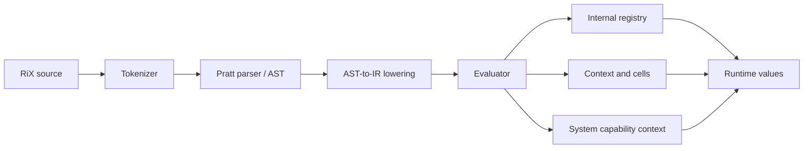

RiX is deliberately layered. Syntax is parsed without executing it; AST nodes lower to a compact intermediate representation; the evaluator dispatches that IR through registries and an explicit system capability context.


```mermaid
flowchart LR
  S["RiX source"] --> T["Tokenizer"]
  T --> A["Pratt parser / AST"]
  A --> L["AST-to-IR lowering"]
  L --> E["Evaluator"]
  E --> R["Internal registry"]
  E --> C["Context and cells"]
  E --> Y["System capability context"]
  R --> V["Runtime values"]
  C --> V
  Y --> V
```

## Repository map

| Path | Responsibility |
|---|---|
| `src/parser/tokenizer.js` | maximal-munch tokens, positions, number/string/comment forms |
| `src/parser/parser.js` | Pratt parser, container syntax, AST construction |
| `src/runtime/system-manifest.js` | parser-visible names derived from the real system capability context |
| `src/eval/lower.js` | AST to `{ fn, args }` IR |
| `src/eval/evaluator.js` | recursive evaluation, imports, capability frames, defaults |
| `src/eval/registry.js` | internal operation registry and multifunction variants |
| `src/eval/functions/` | core, arithmetic, collections, control, methods, diagnostics, units, symbolic work |
| `src/runtime/` | contexts, cells, metadata, semantic types, Shaped storage, methods, exact values, diagnostics |
| `bin/` | REPL/runner and IR conversion CLI |
| `tests/` | parser, evaluator, runtime, and tool behavior |

## Two registries with different jobs

The internal `Registry` contains operations used by lowered IR: assignment, retrieval, calls, container construction, pipes, property access, and arithmetic dispatch. Most are implementation machinery and are not ambient user functions.

The `SystemContext` is the user/host capability object visible as `.`. It contains standard-library functions, math functions, diagnostics, operator references, units/exact collections, and trusted extension hooks. Default contexts are frozen after construction.

That split keeps language semantics available to the evaluator without making every internal operation an unrestricted script capability. The generated [runtime catalog](reference/system-reference.md) lists both surfaces from the current source.

## Public API

```js
import {
  parse,
  tokenize,
  lower,
  evaluate,
  parseAndEvaluate,
  createDefaultRegistry,
  createDefaultSystemContext,
  Context,
} from "@ratmath/rix";
```

Use `@ratmath/rix/parser`, `@ratmath/rix/eval`, and `@ratmath/rix/runtime` for narrower imports. The top-level export intentionally covers the common embedding path plus exact-value construction helpers.

## Adding syntax

1. Add or adjust tokenization in `src/parser/tokenizer.js` when the lexical form is new.
2. Add precedence/parsing and an AST shape in `src/parser/parser.js`.
3. Lower the AST node in `src/eval/lower.js`.
4. Implement or reuse the IR function in `src/eval/functions/`.
5. Register the function in `createDefaultRegistry()` if it is a new internal operation.
6. Add parser, lowering, and evaluator tests in proportion to the feature.
7. Update the canonical syntax guide and regenerate the runtime reference.

Read [parser architecture](parser/architecture.md), [parsing and precedence](parser/parsing.md), and the [AST reference](parser/AST-brief.md) for the detailed model. The [IR design snapshot](design/eval/ir-format.md) preserves the original mapping narrative; use the generated [runtime catalog](reference/system-reference.md#internal-ir-registry) for the complete current dispatch inventory.

## Adding a user-facing capability

Register user-callable work on an unfrozen `SystemContext`, then freeze it before exposing it to untrusted evaluation. If the capability is part of the default runtime, add it in `createDefaultSystemContext()` and place it in an appropriate group in `src/runtime/runtime-config.js`.

Capability grouping matters. Imported scripts can add or remove function groups and the host separately controls permission names such as imports, network, and files. A new capability without an appropriate group makes sandbox policies harder to reason about.

## Adding a semantic type or trait

The type system maintains immutable trait and type registries. A type can define aliases, runtime type, default traits, conversion, normalization, validation, export/import, methods, and system multifunction installations. The [types and traits guide](eval/types-and-traits-guide.md) documents the RiX-facing registration form.

## Tests and documentation

```sh
bun test
bun run build:docs
```

Every `rix/` change should keep the Bun tests green. Documentation builds generate the runtime catalog first, so changes to registered names appear in the reference without a manual inventory pass.

The `documentation/` directory is authored source. The `docs/` directory is generated GitHub Pages output. Historical design material may remain useful, but current behavior belongs in the canonical guides and status page.

For packaging, `bun run test:pack` checks the tarball contents and
`bun run smoke:package` installs RiX against its declared registry dependencies.
Run that gate after Core 0.6.0 is published; an unpublished dependency version
cannot pass the registry check. In the umbrella workspace, `bun scripts/package-consumer-smoke.js
--workspace-core` checks both local tarballs in an isolated consumer. Keep that
rehearsal distinct from the registry release gate; neither command publishes.


## Portable Node and Bun runtime assets

The CLI and public module entry points run on Node.js 22+ and Bun 1.4+.
Installed commands use `#!/usr/bin/env node`; `bun bin/rix.js` and
`bunx --bun --no-install rix` explicitly select Bun. Development tests and
release builds continue to use Bun. Browser-aware bundlers choose the portable
`browser` export condition; filesystem access stays in the Node/Bun adapter.

`plugins/bundled.js` refers to generated JavaScript strings rather than importing
`.rix` files with a runtime-specific text loader. Edit the original `.rix` files,
then run `bun run build:package`. This embeds their exact text in
`plugins/generated/rix-sources.js` and builds `bin/generated/live-runtime/`.
The package includes these outputs so end users need neither a text loader nor
Bun's bundler. RiX source is still parsed and evaluated by RiX, not translated
into JavaScript algorithms. Source paths and plugin metadata remain intact.

`bun run check:package-assets` checks source and output hashes to catch stale
assets. `bun run test:portable` runs real Node and Bun processes against the
module API, async cancellation, CLI/REPL selections, editor tools, and static/live
publication. The isolated package smoke repeats these checks against an installed
tarball. CI covers Node 22, 24, and 26 on Linux alongside Bun. Local checks do not
establish Windows or macOS release certification beyond the actual tested host.


## Verify once, then publish the same state

Run `bun run check:release` independently of publishing. It prepares package
assets, runs every release check, and writes a local ignored receipt at
`tmp/release-verification.json` only after success. A failed or interrupted run
removes the previous receipt. If inputs change during the run, no receipt is
written.

Run `bun run check:publish` to inspect readiness quickly. `npm publish` uses this
same guard through `prepublishOnly`; it does not repeat the expensive suite.
`prepack` checks generated-asset freshness and does not rebuild files after
verification. Finish documentation generation before the full check.

The fingerprint covers tracked and untracked nonignored repository files, the
actual npm file list (including otherwise ignored packaged assets), installed
direct/transitive runtime and development dependencies, relevant lockfiles,
platform/architecture, and Node/Bun/npm versions. A source, test, documentation,
package-version, dependency, or runtime change requires a fresh successful run.
A commit or tag without content changes remains valid. This is a local workflow
receipt; CI verification does not silently approve a different local install.
The internal `check:release:checks` command runs checks without recording a
receipt; use `check:release` for release preparation.
