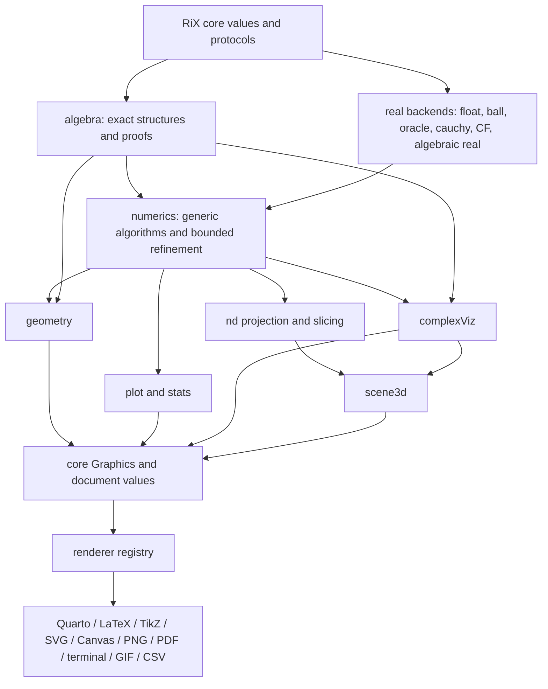

# RiX Plugin System Design Specification

> **Status:** design target. This document distinguishes implemented packages
> from proposed packages. Names and APIs marked *proposed* are not yet part of
> the stable RiX surface.

This specification describes the intended first-party plugin library, the
protocols joining its mathematical layers, and the renderer pipeline used by
RiX hosts. The governing idea is:

> Plugins retain mathematical meaning for as long as possible, lower to shared
> portable values at explicit boundaries, and leave final target encoding to
> renderer plugins.

The design allows exact algebra, several incompatible real-number
representations, numerical algorithms, geometry, plots, higher-dimensional
objects, and document renderers to compose without requiring one universal
numeric type or one universal rendering engine.

## 1. Current and proposed packages

### Implemented foundation

| Package or capability | Status | Present role |
| --- | --- | --- |
| Core `.Graphics` | Implemented in RiX core | Portable 2D scene values: graphics, paths, groups, transforms, text, rectangles, circles, and clips. |
| Core output values | Implemented in RiX core | `Text`, `Paragraph`, `Heading`, `Fragment`, `Table`, `Grid`, `Figure`, `Slide`, and `Slides`. |
| Core `.Algebra` | Partly implemented in RiX core | Exact presentation helpers, currently including synthetic division as a portable `Grid`. |
| `.draw` | Implemented plugin | Convenient 2D authoring helpers that return core `.Graphics` nodes. |
| `.plot` | Implemented initial plugin | Polynomial plotting with automatic vertical fitting; returns core `.Graphics`. |
| `.float` | Implemented plugin | IEEE-754 Float conversion, arithmetic integration, rounding, intervals of stored values, and approximate elementary functions. |
| Plugin catalog | Implemented runtime service | Discovery, metadata, explicit loading, host approval for JavaScript, capability groups, and remounting. |
| HTML/SVG/terminal display | Implemented in current hosts | Initial rendering behavior; intended to migrate toward the renderer contracts below. |

### Proposed first-party packages

| Layer | Plugin | Principal responsibility |
| --- | --- | --- |
| Exact mathematics | `.algebra` | Polynomial/rational-function structures, exact transformations, elimination, factorization, exact root evidence, and algebraic-number support beyond the small core surface. |
| Numeric orchestration | `.numerics` | Generic refinement, enclosure, root finding, integration, optimization, ODE/PDE helpers, sampling, error budgets, and algorithm dispatch. |
| Real backends | `.float`, `.ball`, `.oracle`, `.cauchy`, `.continuedFraction`, `.algebraicReal` | Alternative representations that satisfy shared real-number and enclosure protocols. |
| Geometry | `.geometry` | Exact constructions, transformations, constraints, intersections, implicit loci, and certified drawing refinement. |
| Plotting | `.plot` | Function, parametric, implicit, data, statistical, vector, contour, and heat-map plots. |
| 3D scenes | `.scene3d` | Retained cameras, lights, materials, curves, meshes, surfaces, volumes, projection, and static snapshots. |
| Higher dimensions | `.nd` | N-dimensional points, fields, meshes, implicit regions, projections, slices, sections, and fibers. |
| Complex visualization | `.complexViz` | Domain coloring, magnitude/phase surfaces, Cayley color mappings, Riemann-sphere views, and complex-to-complex projections. |
| Data | `.data` | Relations, schemas, joins, transformations, and presentation-neutral tabular data. |
| Statistics | `.stats` | Exact/approximate summaries, distributions, models, regression, and plot-ready result values. |
| Document features | `.document` | Citations, references, numbering, themes, assets, and report/deck assembly beyond core fragments. |
| Rendering and export | `.quarto`, `.latex`, `.tikz`, `.svg`, `.canvas`, `.png`, `.pdf`, `.terminalAscii`, `.gif`, `.csv` | Target encoders and data exporters registered through shared output protocols. |

Plugin IDs and mount names remain lowercase or lower camel case. Core portable
constructors retain their existing PascalCase system names.

## 2. Layering and dependency direction



The arrows describe data and protocol consumption, not necessarily JavaScript
imports. In particular, `.numerics` should consume interfaces such as
`EnclosableReal`, `ExactPolynomial`, and `SignDecidable`. It should not import
every real-number plugin.

Renderers depend on portable output schemas. An SVG renderer must not need to
understand polynomial factorization, implicit geometry, or an oracle real. A
domain plugin resolves those semantics into a finite scene before target
encoding.

## 3. Shared protocol layer

The protocol names below describe contracts. Their eventual implementation may
use RiX semantic types, traits, multifunction variants, or a registry, but
algorithms should not depend on the mechanism.

### 3.1 Exact algebra protocols

```text
RingElement
FieldElement
ExactPolynomial
ExactRationalFunction
ExactEquationSystem
AlgebraicElement
ExactSignWitness
RootCountProvider
EliminationProvider
```

An exact object preserves its coefficients, variables, defining equations,
field extensions, and proof/evidence data. Decimal sampling is never its
canonical representation.

### 3.2 Real and refinement protocols

```text
EnclosableReal
Refinable
SignDecidable
OrderComparable
Differentiable
Integrable
Sampleable
```

The minimum useful bridge is a certified rational enclosure:

```rix
# Proposed
enclosure := .numerics.Enclose(value, {=
    absoluteWidth = 1 / 1000000,
    relativeWidth = _,
    maxWork = 50000
})
```

```text
Enclosure
  interval       exact RationalInterval
  certified      whether containment is proven
  goalMet        whether the requested width was reached
  work           backend-specific bounded-work report
  source         representation and proof policy
  diagnostics    loss, discontinuity, or nonconvergence information
```

Every potentially unbounded refinement request carries `maxWork`, and where
relevant `maxDepth`, `maxPrecision`, or `timeout`. Failure to decide is a normal
result, not permission to run indefinitely or guess.

### 3.3 Adaptive visualization protocol

Geometry, plots, N-dimensional slices, and complex visualizations use a common
view request:

```text
RefinementRequest
  viewport       mathematical domain or camera frustum
  size           requested output dimensions
  tolerance      mathematical or screen-space tolerance
  maxWork        finite evaluation/subdivision budget
  precision      requested numeric policy
  boundary       unresolved-boundary policy
  seed           deterministic seed where sampling is involved
```

They return:

```text
AdaptiveRenderResult
  value          Graphic, Scene3D, Table, or another portable result
  resolved       whether the requested tolerance was met
  uncertainty    unresolved cells, intervals, singularities, or occlusions
  work           evaluations, subdivisions, and exhausted limits
  source         serializable semantic source and plugin/schema version
```

The source object and static snapshot may be stored independently. A viewer
without the originating plugin can display the snapshot; a viewer with the
plugin can refine the source for a new viewport.

## 4. Algebra, real backends, and Numerics

Algebra can serve Numerics and real-number plugins, but it does so in distinct
ways.

The existing core `.Algebra` should remain the small, stable facade for
standard exact values and portable algebra layouts. The proposed lowercase
`.algebra` plugin is the larger, optional algorithm library. Both can publish
the same versioned algebra protocols, so consumers ask for an exact polynomial,
root counter, or sign witness rather than caring which layer supplied it. If
the larger surface eventually proves small and universal enough for core, the
service boundary still prevents downstream APIs from changing.

### 4.1 What Algebra supplies to Numerics

`.algebra` should provide exact preprocessing and proof-producing operations:

- canonical polynomials and rational functions;
- exact differentiation and transformations;
- square-free decomposition and factorization when available;
- Sturm sequences or other exact real-root counts;
- resultants, Gröbner-style elimination, and constraint reduction;
- exact sign evaluation at rational or algebraic points;
- rational isolating intervals for algebraic roots;
- singularity, pole, and multiplicity information;
- symbolic Jacobians, gradients, and Hessians for numerical algorithms.

Numerics can use these results to avoid blind sampling. For example, a plotter
can ask Algebra for exact poles and critical points, then ask Numerics only to
refine their locations for a particular display.

### 4.2 What Numerics supplies to Algebra-facing work

`.numerics` supplies controlled approximation and algorithms where a symbolic
answer is unavailable or unsuitable:

- refine algebraic isolating intervals;
- approximate exact algebraic values to a display tolerance;
- find candidate roots before exact verification;
- evaluate large symbolic expressions using interval or ball arithmetic;
- perform numerical continuation for branches of solution sets;
- estimate condition numbers and report instability;
- integrate, optimize, or solve differential equations over algebraic inputs.

This is an adapter relationship, not a hard cycle. Algebra remains usable
without Numerics for exact work, while Numerics recognizes exact algebra
providers when installed.

### 4.3 Real-number backend packages

| Plugin | Stored representation | Certified enclosure policy | Best uses |
| --- | --- | --- | --- |
| `.float` | IEEE-754 binary64 | Exact dyadic enclosure of the stored value; elementary-function results are approximate unless backed by directed error analysis. | Fast exploratory computation, screen sampling, compatibility. |
| `.ball` | Midpoint plus outward-rounded error radius | Convert the outward-rounded endpoints to exact rationals. | Robust transcendental work, plots, interval Newton methods. |
| `.oracle` | Procedure answering precision requests | Ask directly for a proven rational interval. | Computable reals and lazy exactness. |
| `.cauchy` | Rational sequence plus convergence modulus | Use the modulus and proven tail bound. A bare sequence is non-certifying. | Constructive analysis and sequence-defined constants. |
| `.continuedFraction` | Finite/rule-generated continued fraction | Use convergents and a proven tail bound; finite rationals terminate exactly. | Diophantine approximation and exact rational recovery. |
| `.algebraicReal` | Polynomial plus rational isolating interval | Refine using exact sign/root-count evidence. | Exact roots, geometry intersections, certified comparisons. |

Each backend registers implementations for the common operations it can
honestly support:

```text
.numerics.Enclose(value, request)
.numerics.Refine(value, request)
.numerics.Compare(a, b, request)
.numerics.Sign(value, request)
.numerics.Sample(function, domain, request)
```

Possible results of comparison and sign include `:undecided`. Overlapping
intervals do not establish equality.

### 4.4 Numerics algorithm families

The `.numerics` namespace should eventually include:

| Family | Proposed commands |
| --- | --- |
| Root work | `IsolateRoots`, `RefineRoot`, `FindRoot`, `IntervalNewton`, `TrackRoot` |
| Calculus | `Differentiate`, `Integrate`, `Quadrature`, `Limit` |
| Optimization | `Minimize`, `Maximize`, `ConstrainedOptimize` |
| Differential equations | `SolveODE`, `SolveBVP`, later `SolvePDE` |
| Linear algebra | `SolveLinear`, `Eigen`, `SVD`, condition/error reports |
| Sampling | `Sample`, `AdaptiveSample`, `GridSample`, `DetectDiscontinuities` |
| Evidence | `Enclose`, `Refine`, `Compare`, `Sign`, `Certify` |

An algorithm result carries method, convergence state, residual/error bounds,
work consumed, and provenance. Returning only a decimal array is insufficient.

## 5. Geometry plugin

`.geometry` owns mathematical objects and constructions, not pixels.

### Values

```text
Point, Line, Ray, Segment, Circle, Conic, Polygon
Transform2D, Construction, Constraint, Locus
ImplicitCurve, ParametricCurve, Intersection
IsolatingPoint, IsolatingBox, GeometryCollection
```

### Operations

```text
Point, Line, Segment, Circle, Conic, Implicit, Parametric
Translate, Rotate, Reflect, Scale, Invert
Parallel, Perpendicular, Midpoint, AngleBisector
Intersect, Tangent, Project, Distance, Incidence
Construct, SolveConstraints, Refine, Draw
```

Exact constructions use Algebra directly where possible. Implicit curves and
uncertain intersections use Numerics through the enclosure/refinement
protocols. `.geometry.Draw` lowers a requested view to core `.Graphics` and
preserves unresolved boxes in `AdaptiveRenderResult.uncertainty`.

```rix
# Proposed
.Plugin.Load("geometry")
ellipse := .geometry.Implicit({=
    equation = {#x, y# 4*(x - 5)^2 + 3*(y - 6)^2 - 7 },
    variables = [:x, :y],
    domain = {= x=[2, 8], y=[3, 9] }
})

view := ellipse.Refine({=
    viewport = {= x=[2, 8], y=[3, 9] },
    size = [720, 480],
    tolerance = 1 / 1000,
    maxWork = 20000
})
```

## 6. Plot plugin

The current `.plot.Polynomial(coefficients, domain, options?)` is the first
member of a broader plotting package.

### Proposed plot constructors

```text
Polynomial, Function, Parametric, Polar, Implicit
Scatter, Line, Step, Bar, Histogram, BoxPlot
Contour, HeatMap, Image, VectorField, StreamPlot
Surface, ParametricSurface, ImplicitSurface
Axes, Scale, ColorScale, Legend, Annotation
```

### Automatic fitting

`FitView` should determine a useful y range from an x range by combining:

1. exact discontinuity and critical-point information from Algebra;
2. certified/adaptive samples from Numerics;
3. robust policies for outliers, poles, empty domains, and unresolved regions;
4. explicit padding, aspect, clipping, and minimum-span options.

```rix
# Proposed
view := .plot.FitView(F, {=
    x = [-5, 5],
    size = [720, 420],
    includeZero = :auto,
    discontinuities = :split,
    outliers = :report,
    maxWork = 50000
})

graphic := .plot.Function({= fn=F, view=view })
```

Plotting owns scales, axes, legends, sampling choices, and chart layout. It
returns `.Graphics` for 2D output or `Scene3D` for surfaces. Heat maps may use a
portable raster/tile node if that becomes part of the scene schema, but must
always provide SVG/PNG snapshot lowering.

## 7. Scene3D plugin

`.scene3d` defines a retained three-dimensional scene. It must not expose
WebGL state as the value.

### Scene values

```text
Scene, Group3D, Transform3D
Point3D, PointCloud, Polyline3D
Mesh, ParametricSurface, ImplicitSurface, Volume
Camera, OrthographicCamera, PerspectiveCamera
Light, Material, Texture, ColorMap
ClipPlane, SlicePlane, Annotation3D
```

### Operations

```text
Scene, Group, Transform, Mesh, Surface, Volume
Camera, Light, Material, Clip, Slice
Project, Refine, Snapshot, Animate
```

An interactive host can orbit a retained scene. Static renderers request a
camera projection and lower the result to `.Graphics` or a raster image.
Hidden-surface removal, lighting, tessellation, and depth sorting belong to a
Scene3D renderer/refiner, not the SVG renderer.

```rix
# Proposed
.Plugin.Load("scene3d")
surface := .scene3d.ParametricSurface({=
    fn = (u, v) -> [u, v, .Sin(u) * .Cos(v)],
    u = [-3, 3],
    v = [-3, 3],
    material = {= color="#4b9cd3", opacity=17/20 }
})

scene := .scene3d.Scene({=
    objects = [surface],
    camera = .scene3d.Camera([6, 5, 7], [0, 0, 0]),
    lights = [.scene3d.Light(:directional, [1, -1, -1])]
})
```

## 8. Higher-dimensional plugin

`.nd` retains N-dimensional semantics and performs explicit dimensional
reduction. It does not pretend an N-dimensional object is intrinsically 3D.

### Values

```text
PointN, VectorN, BasisN, FrameN
PolylineN, MeshN, PolytopeN
ScalarFieldN, VectorFieldN, ImplicitRegionN
ProjectionN, SliceN, FiberN, SampleN
```

### Operations

```text
Project(object, targetDimension, projection)
Slice(object, affineConstraint)
Section(object, planeOrSubspace)
Fiber(mapping, targetValue)
Marginalize(field, dimensions)
Sample(object, request)
ToScene3D(object, view)
ToGraphic(object, view)
```

Projection and slicing are separate:

- **projection** maps every point into fewer dimensions and may overlap data;
- **slice/section** selects points satisfying a lower-dimensional constraint;
- **fiber** retains the preimage of a selected output value;
- **marginalization** aggregates over omitted dimensions.

```rix
# Proposed: a four-dimensional implicit region viewed as a 3D section
region := .nd.ImplicitRegion({=
    variables = [:x, :y, :z, :w],
    relation = {#x, y, z, w# x^2 + y^2 + z^2 + w^2 <= 1 }
})

section := .nd.Slice(region, {#x, y, z, w# w == 1/3 })
scene := .nd.ToScene3D(section, {=
    coordinates = [:x, :y, :z],
    maxWork = 30000
})
```

The result retains the projection/slice transform and uncertainty, so labels,
selection, and later refinement can refer back to the original dimensions.

## 9. Complex visualization plugin

`.complexViz` consumes complex-valued functions and produces `.Graphics` or
`Scene3D`. It composes with Algebra for exact complex structure, with real
backends/Numerics for evaluation, and with `.scene3d` for retained surfaces.

### Proposed views

| View | Meaning |
| --- | --- |
| `DomainColoring` | Input plane is position; output magnitude/phase determine lightness, saturation, and hue. |
| `MagnitudePhaseSurface` | Input plane is horizontal position; transformed magnitude is height; phase is color. |
| `CayleySurface` | Input plane is horizontal position; Cayley magnitude `r` is height; Cayley direction `t` determines color. |
| `RiemannSphere` | Complex domain or range mapped to the sphere, with poles and infinity represented geometrically. |
| `ImageSurface` | User-selected projection of `(Re z, Im z, Re f(z), Im f(z))` into 2D or 3D. |
| `ArgumentContours` | Contours of phase/direction, optionally over magnitude shading. |
| `CriticalMap` | Zeros, poles, branch cuts, critical points, and uncertainty overlays. |

### Cayley height/color mapping

For `f(z) = Cayley(r, t)`, the proposed default is:

- horizontal coordinates: `Re(z)` and `Im(z)`;
- height: `heightScale(r)`, commonly `r`, `log(1+r)`, or a clipped value;
- hue: the projective Cayley direction `t`;
- saturation/value: confidence, magnitude bands, or user-selected metadata.

Because `t = tan(theta/2)`, finite `t` and the one projective point `Infinity`
cover the entire direction circle. The visualization need not change the exact
Cayley value into a stored angle. A numerical/color adapter approximates the
corresponding circular position only at render time, with `Infinity` mapped to
the negative-real direction.

```rix
# Proposed
.Plugin.Load("complexViz")
.Plugin.Load("scene3d")

F := (z) -> (z^3 - 1) / (z^2 + 1)

surface := .complexViz.CayleySurface({=
    fn = F,
    domain = {= re=[-2, 2], im=[-2, 2] },
    height = {= source=:magnitude, scale=:log1p, clip=[0, 4] },
    color = {= source=:cayleyDirection, map=:cyclic },
    poles = :mark,
    unresolved = :desaturate,
    resolution = [240, 240],
    maxWork = 150000
})

scene := .scene3d.Scene({= objects=[surface] })
```

For a genuinely complex-to-complex graph there are four real dimensions.
`ImageSurface` must therefore record the chosen projection instead of implying
that one 3D view is canonical. Useful projections include:

```text
(Re z, Im z, |f(z)|) with phase color
(Re z, Re f(z), Im f(z)) with Im z animation/slices
(Re f(z), Im f(z), |z|) with input phase color
an .nd projection of (Re z, Im z, Re f(z), Im f(z))
```

Zeros, poles, branch cuts, and numerically unresolved samples are semantic
features. Renderers should receive explicit markers/masks, not infer them from
NaN pixels. Uncertainty can be shown through desaturation, opacity, hatching,
or a separate overlay.

## 10. Renderer protocol

Renderers register support for an input value type and a target. The common
entry point is conceptually:

```rix
# Proposed
representation := .Render(value, :svg, {=
    size = [720, 480],
    theme = :light,
    precision = {= digits=12 },
    assets = :external
})
```

```text
RenderRequest
  target          symbolic target or MIME type
  size            page, viewport, or frame dimensions
  theme/style     presentation context
  precision       exact-value formatting and refinement policy
  assets          inline, external, directory, or host-managed
  accessibility   alt text, semantic table, reading order
  animation       timing, frame rate, transition policy
  fallback        allowed fallback targets
```

```text
RenderResult
  target          actual target produced
  mime            MIME type
  content         text, bytes, or host asset reference
  assets          subsidiary files and stable names
  diagnostics     unsupported/lowered features and warnings
  deterministic   whether identical inputs/options reproduce bytes
```

Unsupported features produce diagnostics or a negotiated fallback. They are
not silently discarded.

### Renderer packages

| Plugin | Primary inputs | Output and responsibilities |
| --- | --- | --- |
| `.svg` | `Graphic`, standalone `Figure`; projected `Scene3D` | SVG text/bytes, clipping, paths, exact-to-decimal coordinate policy, metadata, accessibility. |
| `.canvas` | `Graphic`; projected `Scene3D`; rapidly changing plot frames | Browser `CanvasRenderingContext2D` drawing plan and host-owned surface. Optimized for repainting, large sample counts, hit-test metadata, and interactive views; provides PNG snapshots because a canvas is not itself a portable serialized result. |
| `.png` | `Graphic`, rendered document region, `Scene3D`, slide frame | Raster image; delegates scene construction to SVG/Scene3D and owns resolution, antialiasing, color profile, and transparency. |
| `.terminalAscii` | Scalars, tables, grids, fragments, graphics, slides | Strict ASCII output with widths, pagination, line styles, plot approximation, and no Unicode dependency. A future terminal-Unicode renderer may offer richer glyphs. |
| `.tikz` | `Graphic`, geometry diagrams, plot snapshots | TikZ/PGF source, coordinates, paths, labels, styles, and optional PGFPlots lowering. Reports unsupported raster/3D effects. |
| `.latex` | `Fragment`, `Document`, `Table`, `Grid`, `Figure`, `Slides` | `.tex` plus assets; mathematical formatting, environments, numbering, references, and package declarations. May delegate graphics to TikZ, SVG conversion, PDF, or PNG. |
| `.quarto` | `Fragment`, `Document`, `Slides` | `.qmd` plus assets/front matter; emits Markdown where portable and raw target blocks only when necessary. Preserves labels, citations, and executable-source policy. |
| `.pdf` | Documents, figures, slides | Final PDF bytes/assets. May use LaTeX/Quarto for documents, SVG/TikZ for vector figures, PNG for raster content, and Scene3D snapshots. Records its toolchain. |
| `.gif` | `Slides`, animation/timeline, rotating `Scene3D` | Animated GIF; expands a deterministic timeline, renders frames through PNG/raster services, controls duration/dithering/looping, and reports unsupported interactivity. |
| `.csv` | `Table`, relation/data values | RFC-style delimited text plus dialect metadata: delimiter, quoting, newline, encoding, headers, and scalar formatting. CSV is a data exporter, not a renderer for arbitrary graphics or documents. TSV is the same service with a different dialect. |

The plugins may also expose convenience namespaces such as
`.svg.Render(value, options)`, but renderer negotiation should use the shared
registry so document exporters can request subordinate assets without knowing
which exact implementation is installed.

### Composition examples

```text
Document -> Quarto -> QMD + SVG/PNG assets
Document -> LaTeX -> TEX + TikZ/PDF/PNG assets -> PDF
Geometry -> AdaptiveRenderResult.Graphic -> SVG / TikZ / terminal ASCII
Scene3D -> camera snapshot -> Graphic or raster -> SVG / PNG / PDF
Slides -> timeline -> frame renderer -> PNG frames -> GIF
Table / Relation -> scalar formatting policy -> CSV / TSV
```

The PDF plugin is an orchestrator, not a second implementation of every table,
math, and graphics layout. The GIF plugin similarly owns sequencing and frame
encoding, while slide layout and scene rendering remain separate services.

Canvas is intentionally a host renderer rather than a new semantic scene
model. It traverses the same core `Graphic` tree as SVG, so `.draw`, `.plot`,
and `.geometry` do not choose between SVG and Canvas. SVG remains the portable
vector representation; Canvas is the fast browser execution target.

Not every useful output format is a renderer in the narrow sense. The registry
should distinguish target families while retaining one negotiation surface:

| Target family | Useful formats |
| --- | --- |
| Semantic/data | RiX JSON, JSON/JSON Lines, CSV/TSV; later Arrow or Parquet when columnar interchange is justified. |
| Web/document | HTML, Markdown, Quarto, LaTeX, MathML, PDF, and presentation formats such as PPTX. |
| 2D image | SVG, Canvas display, PNG, WebP, and PDF figure pages. |
| Animation | GIF for broad compatibility; APNG and WebM/MP4 for better color, size, or timing. |
| 3D interchange | glTF/GLB first, with STL/OBJ/PLY adapters where manufacturing or mesh tools require them. |

Formats should be added only when their source semantic type is clear. For
example, CSV exports a table but cannot faithfully encode nested fragments,
cell-spanning grids, graphics, or formulas without an explicit flattening
policy and diagnostics.

## 11. Documents, figures, and slides

Core output values are the exchange layer for report plugins and renderers.

- `Table` retains cell values and presentation metadata.
- `Grid` supports ruled mathematical layouts such as synthetic division.
- `Figure` adds caption, label, alt text, and numbering metadata.
- `Fragment`/`Document` preserve structured prose and embedded values.
- `Slide`/`Slides` preserve ordered content, notes, timings, and transitions.

For GIF export, a slide without timing uses a renderer default or deck-level
duration. A transition becomes a sequence of intermediate frames only if its
semantics are supported. Interactive widgets must provide a static snapshot or
produce an explicit unsupported result.

## 12. Plugin manifests and service discovery

The current manifest fields—`id`, `description`, `kind`, `mount`, `exports`,
`groups`, `permissions`, and `defaultEnabled`—remain the discovery baseline.
Future compatibility fields should include:

```yaml
version: 0.2.0
rix: ">=0.2 <0.3"
requires: [numerics-protocol@1, graphics-schema@1]
optional: [algebra@1, ball@1]
provides: [rix.real.enclosure@1, rix.renderer.svg@1]
schemas: [rix.float.ieee754@1]
targets: [image/svg+xml]
snapshot: true
deterministic: true
```

These fields are proposed; the current small YAML parser and validator do not
yet enforce version ranges or service resolution.

Plugin loading proceeds in four steps:

1. discover metadata without executing the plugin;
2. resolve required protocol/service versions;
3. obtain host approval for JavaScript/native/DOM/filesystem/network access;
4. install implementations and register services atomically.

A failed install must not leave half-registered operator variants or renderer
handlers.

## 13. Repository layout

During the alpha phase, first-party plugins should remain in the main RiX
repository so changes to protocols, schemas, hosts, and tests are coordinated.

```text
rix/plugins/
  design-spec.md
  draw/
  plot/
  float/
  algebra/                 # proposed
  numerics/                # proposed orchestration
  real-ball/               # proposed real backend
  oracle/                  # specification; proposed real backend
  real-cauchy/             # proposed real backend
  real-continued-fraction/ # proposed real backend
  real-algebraic/          # proposed real backend
  geometry/                # proposed
  scene3d/                 # proposed
  nd/                      # proposed
  complex-visualization/   # proposed
  render-svg/              # proposed extraction from hosts
  render-canvas/
  render-png/
  render-terminal-ascii/
  render-tikz/
  render-latex/
  render-quarto/
  render-pdf/
  render-gif/
  export-csv/
```

Separate repositories become appropriate when a plugin has an independent
release cadence, substantial native/browser dependencies, third-party
ownership, or a stable protocol contract. Repository location must not change
the manifest or runtime contract.

Teaching-only plugins belong under `rix/examples/plugins/`, not this directory.

## 14. Recommended implementation sequence

1. Standardize `Enclosure`, `RefinementRequest`, `AdaptiveRenderResult`, and
   renderer request/result records, including serialization tests.
2. Expand `.numerics` with bounded `Enclose`, `Refine`, `Compare`, `Sign`, and
   adaptive sampling over the existing `.float` backend.
3. Implement the `.oracle` rational/bisection/Newton-funnel milestone from its
   [paper-based specification](oracle/specification.md), and use its exact
   enclosures to prove that Numerics is not coupled to IEEE floats. Ball or
   algebraic-real arithmetic can be the next independent backend.
4. Implement `.geometry` points, lines, circles, conics, intersections, and an
   implicit-curve refiner with visible unresolved-cell reporting.
5. Expand `.plot` with `Function`, `FitView`, discontinuity handling, contours,
   and heat maps using Numerics.
6. Extract the existing SVG/terminal behavior into renderer registrations, add
   Canvas over the same `Graphic` traversal contract, then add PNG and TikZ.
7. Implement the retained `.scene3d` schema and deterministic static snapshot.
8. Add `.nd` projection/slicing and validate it with a 4D-to-3D section example.
9. Add `.complexViz.DomainColoring` and `.complexViz.CayleySurface`, including
   poles, projective infinity, and uncertainty visualization.
10. Add CSV/TSV early as a small `Table`/relation exporter. Add
    Quarto/LaTeX/PDF document pipelines and GIF slide sequencing after renderer
    asset negotiation is stable.

## 15. Design invariants

The following are requirements across all packages:

1. Exact values remain exact until an explicit approximation/refinement step.
2. Approximate and certified results are visibly distinct.
3. Every potentially unbounded algorithm accepts a finite work policy.
4. Mathematical plugins do not emit backend-specific markup as their primary value.
5. Renderers do not solve domain mathematics.
6. Static snapshots accompany interactive or plugin-specific outputs.
7. N-dimensional reductions record their projection or slice semantics.
8. Complex color mappings state their phase/direction convention and treatment of infinity.
9. Unsupported target features produce diagnostics rather than disappearing.
10. Serialized values identify their schema and originating plugin version.
11. JavaScript/native execution requires explicit host approval.
12. Plugin service installation is deterministic and atomic.

Related background is available in the broader
[Plugin Roadmap and Rendering Contracts](../documentation/design/plugins.md),
[Structured Output Model](../documentation/design/eval/output-model.md), and
[Exact Cayley Polar Complex Numbers](../documentation/design/eval/cayley-polar.md).
